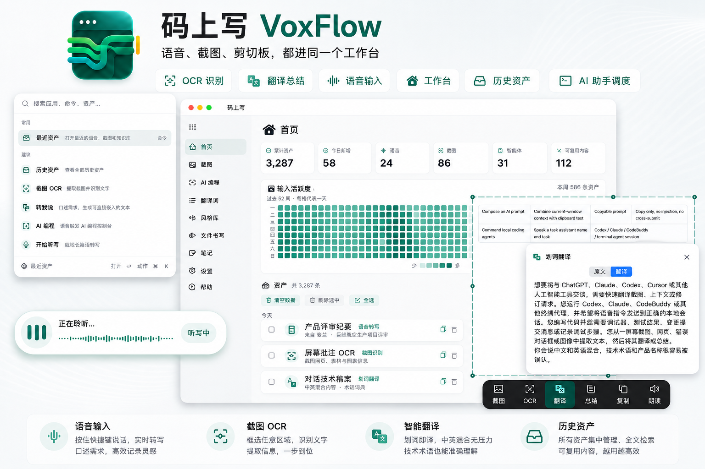

<div align="center">
  

  

  <h1>码上写 · VoxFlow</h1>
  <p><strong>语音、截图、剪切板和 coding-agent 指令的 macOS 资产工作台。</strong></p>
  <p>按 <code>Option + Space</code> 打开启动台，找回最近语音、截图和剪切板资产；按住说话、框选截图、复制内容都会沉淀为可搜索、可复制、可复用的历史资产。</p>
  <p><sub><a href="README_EN.md">English</a></sub></p>

  <p>
    
    <a href="https://github.com/xingbofeng/VoxFlow/releases/latest"></a>
    <a href="LICENSE"></a>
  </p>
  <p>
    🌐 <a href="https://xingbofeng.github.io/VoxFlow/">官方网站</a>
    &nbsp;·&nbsp;
    ⬇️ <a href="https://github.com/xingbofeng/VoxFlow/releases/latest">下载最新版</a>
    &nbsp;·&nbsp;
    🎬 <a href="docs/assets/voiceinput-demo-land.mp4"></a>
  </p>
</div>


## 核心能力速览

码上写是一个贴在当前应用上的资产工作台和快速启动台。它不是语音助手，不接管窗口，不自动发送内容；它把语音、截图、剪切板和 Agent 指令沉淀为可检索、可预览、可复用的本地资产，再送回你正在工作的地方。

| 你想做什么 | 怎么触发 | 输出到哪里 | 边界 |
| --- | --- | --- | --- |
| 打开启动台 | `Option + Space` | Raycast 风格启动台 | 首屏默认选中“最近资产”，可键盘导航 |
| 找回最近资产 | 启动台 → 最近资产 | 二级资产浏览器 | 语音、截图、剪切板统一搜索和筛选 |
| 语音输入 | 按住快捷键说话，松开 | 当前光标位置 | 不抢焦点，不自动发送 |
| 管理剪切板资产 | 复制文本、图片、文件、链接或颜色 | 历史资产 | 避免噪音规则仍会过滤不需要保存的内容 |
| 易错词纠错 | ASR final 和可选 LLM 后自动运行 | 插入前文本 | 本地确定性规则，候选是否启用由你决定 |
| 剪贴板图片 OCR | 复制图片后按 `Command + Shift + V` | 当前光标位置 | 只处理剪贴板图片，不启动普通听写 |
| 框选截图处理 | 按 `Command + Shift + A` 框选屏幕 | OCR 结果面板 | 可继续翻译、总结、朗读；识别结果可回看 |
| 划词动作 | 选中文本后按 `Command + Shift + D/J/K/L` | 动作 HUD 或结果面板 | D 打开动作卡；J 翻译、K 总结、L 发给任务助手 |
| 截图记录回看 | 工作台 → 截图 | 本地截图历史与 OCR 文本 | 本地保存，可搜索、收藏、分页、复制与删除 |
| 任务助手 | 读取当前窗口上下文 + 口述意图 | 可复制提示词 | 只复制，不注入，不自动提交 |
| AI Coding 助手控制台 | 说出任务助手名称和任务 | 本地 Codex / Claude / CodeBuddy / 终端 Agent | 只投递已注册会话 |

## 适合谁

- 经常和 ChatGPT、Claude、Codex、Cursor 或其他 AI 工具沟通，需要快速描述需求、上下文和修改意见。
- 同时开着 Codex、Claude、CodeBuddy 或其他终端 Agent，希望用语音把指令派给对应任务助手。
- 写代码时常要解释 bug、补充注释、写提交说明、记录排查过程。
- 经常需要从截图、网页、报错弹窗或图片里提取文字，并进一步翻译或总结。
- 中英文混说比较多，希望技术词、产品名和专有名词更稳定。

## 阅读路线

| 如果你想... | 直接看 |
| --- | --- |
| 先装起来用 | [快速开始](#快速开始) |
| 了解启动台和历史资产 | [纠错、OCR 和 Agent 工作流](#纠错ocr-和-agent-工作流) |
| 了解语音模型 | [语音输入与识别模型](#语音输入与识别模型) |
| 了解 OCR、翻译、总结和 Agent | [纠错、OCR 和 Agent 工作流](#纠错ocr-和-agent-工作流) |
| 确认数据会去哪 | [隐私说明](#隐私说明) |
| 了解技术栈和开源依赖 | [技术栈与开源依赖](#技术栈与开源依赖) |
| 从源码开发 | [从源码运行](#从源码运行) |

## 语音输入与识别模型

### 按住说话，松开输入

码上写默认使用快捷键触发听写。按住说话时，屏幕上会出现一个轻量的转写浮层；松开后，最终文字会自动输入到当前光标位置。

你不需要切换应用，也不需要手动复制粘贴。它就像键盘一样，服务于当前正在使用的 App。

### 实时转写

说话过程中可以看到实时文本。短句、长段说明、中文、英文和中英混合内容都会即时显示，方便你边说边确认方向。

码上写内置系统语音识别，也支持本地和在线 ASR Provider。系统自带模型开箱可用；本地 Qwen3-ASR、Whisper、FunASR、SenseVoice、NVIDIA Nemotron、Parakeet、Omnilingual 等路线适合更重视离线能力、隐私和可控性的场景；在线 Groq、腾讯云、阿里云适合不想下载本地模型或需要云端能力的场景。模型页会明确标注“离线 / 在线”“流式 / 非流式”“中文 / 英文 / 多语言”等标签。

### 支持的语音模型

码上写不会把所有模型强行塞进同一个运行时。不同模型的上游格式、流式能力、语言覆盖和隐私边界不同，所以会按模型选择最合适的 Provider target 或云端 runtime。

#### 离线 / 本地模型

这些 Provider 的音频不上传到第三方云服务；除“系统自带”可能依赖 Apple 系统服务外，本地模型都在本机完成推理。

| 模型 | 状态 | 流式能力 | 运行路线 | 语言侧重 | 适合场景 |
| --- | --- | --- | --- | --- | --- |
| 系统自带 | 开箱可用 | 流式 | Apple Speech / SFSpeechRecognizer | 取决于 macOS 语音识别语言 | 不下载模型、先快速开始 |
| Qwen3-ASR 0.6B | 已支持 | 流式 partial + final | speech-swift `Qwen3ASR` / MLX 4bit | 中文、英文、多语言 | 默认推荐本地听写，体积和速度更均衡 |
| Qwen3-ASR 1.7B | 已支持 | 流式 partial + final | speech-swift `Qwen3ASR` / MLX 8bit | 中文、英文、多语言 | 更高准确率本地听写，需要更高内存 |
| FunASR Nano INT8 / FP32 | 已支持 | 流式片段确认 | Sherpa-ONNX | 中文、英文 | 中文本地备选，不依赖 CoreML |
| Whisper Turbo / Large V3 | 已支持 | 非流式 | WhisperKit | 多语言 | 录音结束后的高质量完整转写 |
| SenseVoice | 已支持 | 当前按非流式/短句使用 | FluidAudio / CoreML | 中文、英文、多语言 | 本地多语种短句转写 |
| Paraformer Large zh | 已支持 | 流式片段确认 | FluidAudio / CoreML int8 | 中文 | 中文本地转写 |
| NVIDIA Nemotron 0.6B | 已支持 | 原生流式 | speech-swift `NemotronStreamingASR` / CoreML | 多语言 | 本地流式转写候选 |
| Parakeet Streaming | 已支持 | 原生流式 | speech-swift `ParakeetStreamingASR` / CoreML | 英文和欧洲语种 | 英文低延迟听写 |
| Omnilingual ASR | 已支持 | 非流式 | speech-swift `OmnilingualASR` / CoreML | 超多语言 | 广语言覆盖、文件/实验场景 |

#### 在线 / 云端模型

在线 Provider 会把录音发送到对应服务商。API Key、SecretId、SecretKey 等凭据保存在本地 SQLite 设置表中，设置页支持用“眼睛”按钮临时显示或隐藏。

| Provider | 状态 | 流式能力 | 默认模型 / 接口 | 配置项 | 适合场景 |
| --- | --- | --- | --- | --- | --- |
| Groq（免费） | 已支持 | 非流式 | OpenAI-compatible audio transcription，默认 `whisper-large-v3-turbo` | API Key、模型名 | 不下载本地模型，松开后快速返回最终文本 |
| 腾讯云 | 已支持 | 实时流式 | 腾讯云实时语音识别 WebSocket，默认 `16k_zh` | AppID、SecretId、SecretKey | 中文普通话实时云端听写 |
| 阿里云 | 已支持 | 实时流式 | DashScope WebSocket，默认 `fun-asr-realtime` | 百炼 API Key | 中文和多语言实时云端听写 |
| 火山云 | 待实现 | 计划流式 | 豆包语音大模型流式 ASR WebSocket | 待定 | 后续接入火山云实时 ASR |
| Mistral Voxtral | 待实现 | 待定 | 官方 Voxtral 语音能力 | 待定 | 预留在线 Provider |
| AssemblyAI | 待实现 | 待定 | AssemblyAI Transcription | 待定 | 预留在线 Provider |
| ElevenLabs Scribe | 待实现 | 待定 | ElevenLabs Scribe | 待定 | 预留在线 Provider |

## 纠错、OCR 和 Agent 工作流

### 易错词与可选 LLM 纠错

语音识别在技术词上容易出错，例如把 Python、JSON、TypeScript 识别成谐音或拆开的词。码上写可以在听写完成后，用你配置的 OpenAI 兼容模型做一次保守纠错。

新版“易错词”是独立一级页面，会在 ASR final 和可选 LLM 之后做本地确定性修正；也可以从你后续手动修改的内容中学习候选规则。LLM 纠错不会替你润色或改写，只修明显听错的词，你仍然掌控原文语气和表达。

### 剪贴板 OCR、框选截图、翻译和总结

复制截图后按 `Command + Shift + V`，码上写会识别剪贴板图片里的文字并粘贴到当前光标。按 `Command + Shift + A` 框选屏幕区域时，会打开结果面板，支持原图、OCR、翻译和总结视图。

这个能力适合处理网页、报错弹窗、截图、设计稿和聊天记录。OCR 结果可以继续复制、朗读、翻译或总结，但不会进入易错词的永久学习链路。

### 任务助手与 AI Coding 助手控制台

“任务助手”适合把当前窗口的可见上下文、OCR 文本和你的口述意图整理成一段可复制的提示词；它只复制结果，不自动发送。

AI Coding 助手控制台面向本地 coding-agent 终端。开启后，你可以按住语音快捷键说出任务助手名称和指令，码上写会解析目标 Agent、展示确认状态，并把指令投递到对应的 Codex、Claude、CodeBuddy 或任意已注册终端会话。

### 工作台

除了菜单栏快速输入，码上写也提供完整资产工作台：

| 页面 | 可以做什么 |
| --- | --- |
| 首页 | 查看历史资产、今日新增、来源分布和可复用内容；搜索、复制或删除语音、截图和剪切板资产 |
| 易错词 | 管理本地确定性纠错规则、候选学习、启用状态和最近事件 |
| 风格 | 为不同应用或场景设置输出风格，比如原文、正式、邮件、编程说明 |
| 文件转写 | 导入音频或视频，排队转写，导出 txt、md、srt，或保存为笔记 |
| 笔记 | 直接录音记笔记，也可以编辑、搜索和回看记录 |
| 截图 | 浏览截图记录，查看原图和 OCR 文本，支持收藏、搜索、分页和快捷复制/删除 |
| AI Coding 助手 | 查看已注册 Agent 任务助手、别名、工作目录、分支和调度记录 |
| 设置 | 管理输入设备、快捷键、模型、翻译模型、权限、隐私和数据 |
| 帮助 | 查看权限提示、版本信息、项目链接和常见入口 |

## 功能亮点

- **VoxFlow Palette 启动台**：`Option + Space` 打开 Raycast 风格入口，默认选中“最近资产”，支持上下键、回车和 `Command + K` 动作面板。
- **历史资产工作台**：语音 ASR 成功结果、截图、剪切板文本/图片/文件/链接/颜色统一进入资产体系，首页按资产数量、来源分布和可复用内容展示。
- **全局听写**：在任意可编辑输入框里使用，不局限于码上写自己的窗口。
- **不抢焦点的浮层**：听写时只显示轻量浮层，不打断当前应用。
- **多 Provider ASR**：系统语音识别开箱可用，本地 Qwen3-ASR、Whisper、FunASR、SenseVoice、NVIDIA Nemotron、Parakeet、Omnilingual 等 Provider 逐步接入统一运行时；暂不支持实时流式的 Provider 会在模型页标注“非流式”。
- **稳定文本插入**：粘贴前临时切换输入源，完成后恢复输入源和剪贴板，减少 CJK 输入法干扰。
- **输入设备选择**：支持选择麦克风，长设备名会自动收纳，不挤爆界面。
- **快捷键录制**：在设置里直接录制想用的触发键，并配置短按行为。
- **剪贴板图片 OCR**：复制截图或图片后按 `Command + Shift + V`，自动识别图片文字并粘贴到当前输入框。
- **框选截图 OCR**：按 `Command + Shift + A` 框选屏幕区域，结果面板支持查看原图、OCR、翻译和总结。
- **AI Coding 助手控制台**：用语音把指令投递给本地终端里的 Codex、Claude、CodeBuddy 或其他已注册 Agent。
- **任务助手**：结合当前窗口 OCR 上下文和口述意图生成提示词，只复制结果，不自动发送。
- **OpenAI 兼容模型**：可添加、测试、编辑和删除 Provider，LLM API Key 保存到 macOS Keychain。
- **易错词和上下文热词**：用本地规则修正常见误识别，也可从当前窗口 OCR 提取临时上下文词。
- **历史和笔记**：输入、截图和复制内容不只是一闪而过，后续可以搜索、复制、整理和复用。
- **文件转写**：把录音、视频、会议音频转成文字，适合复盘和归档。
- **截图记录库**：所有截图记录（原图 + OCR 文本）都可回看，支持收藏、搜索、分页、复制与删除。
- **内联截图标注**：框选截图支持画笔、形状、文字、马赛克等标注与撤销重做，并支持滚动长图回看。
- **数据可控**：历史、词汇、设置和笔记保存在本机；是否启用 LLM 由你决定。

## 快速开始

### 下载安装

从 [GitHub Releases](https://github.com/xingbofeng/VoxFlow/releases/latest) 下载最新版本：

1. 打开 `VoxFlow-1.8.1-macOS.dmg`
2. 将 `VoxFlow` 拖入 `Applications` 文件夹
3. 首次启动时，如果 macOS 提示无法验证，请按住 Control 点击应用，选择“打开”

安装后可直接打开工作台里的“截图”页，确认截图记录与 OCR 回看是否可用。

> 如果你想体验当前 `main` 分支上的易错词、AI Coding 助手 或截图 OCR 最新实现，请从源码运行；这些能力可能晚于最新稳定版 Release。

### 系统要求

- macOS 15 Sequoia 或更高版本
- 一台带麦克风的 Mac

### 首次授权

码上写需要几个系统权限才能正常工作：

| 权限 | 用途 | 位置 |
| --- | --- | --- |
| 辅助功能 | 监听全局快捷键，并把文字输入到当前应用 | 系统设置 -> 隐私与安全性 -> 辅助功能 |
| 麦克风 | 录制你的声音 | 系统设置 -> 隐私与安全性 -> 麦克风 |
| 语音识别 | 使用系统自带语音识别模型 | 系统设置 -> 隐私与安全性 -> 语音识别 |
| 屏幕录制 | 为“任务助手”和截图 OCR 读取当前窗口文字与截图；截图记录保存在本机便于回看 | 系统设置 -> 隐私与安全性 -> 屏幕录制 |

如果你选择本地 Qwen3-ASR 模型，语音识别权限不是必须的；麦克风权限仍然需要。

授权后如果快捷键没有响应，退出码上写后重新打开即可。

### 默认快捷键

| 快捷键 | 作用 |
| --- | --- |
| `Option + Space` | 打开 VoxFlow Palette 启动台 |
| 听写快捷键 | 按住说话，松开后输入到当前光标位置；可在设置里修改 |
| `Command + Shift + V` | 识别剪贴板图片并粘贴 OCR 文本 |
| `Command + Shift + A` | 框选截图并打开 OCR 结果面板 |
| `Command + Shift + D` | 对当前选中文本打开划词动作 HUD |
| `Command + Shift + J` | 直接翻译当前选中文本 |
| `Command + Shift + K` | 直接总结当前选中文本 |
| `Command + Shift + L` | 直接把当前选中文本发给任务助手 |

划词动作相关快捷键都可以在“设置 → 划词动作 → 启用方式”里单独修改或清空。

## 怎么使用

### 语音输入

1. 把光标放到任意输入框。
2. 按住听写快捷键。
3. 开始说话，浮层会实时显示识别结果。
4. 松开快捷键，文字会自动输入到光标所在位置。

### 录音记笔记

打开工作台里的“笔记”，点击录音按钮即可开始记录。说话过程中会实时转写，完成后可以继续编辑，也可以在最近记录中回看。

### 文件转写

打开“文件转写”，选择音频或视频文件。码上写会显示任务进度，完成后可以复制、导出，或保存为笔记。

### 剪贴板图片 OCR

复制一张截图或图片后，按 `Command + Shift + V`。码上写会读取剪贴板中的图片，自动 OCR 识别其中的文字，并粘贴到当前光标所在位置。

如果剪贴板里没有图片，这个快捷键不会启动普通语音听写；它只用于剪贴板图片 OCR 工作流。

### 框选截图 OCR、翻译和总结

按 `Command + Shift + A` 后框选屏幕区域。码上写会用系统截图读取画面、运行 OCR，并打开结果面板。你可以在“原图 / OCR / 翻译 / 总结”之间切换，也可以复制或朗读对应内容。

翻译模型可以使用 Apple 系统翻译、已配置的 LLM，或本地翻译模型；总结可以走已配置 LLM 或本地总结模型。没有可用模型时，OCR 原文仍然可用。

### 截图记录库

每次 `Command + Shift + A` 触发的截图都会被保留为本地截图记录，便于后续回看。你可以在工作台打开“截图”页面，使用关键词搜索、收藏筛选、分页浏览，并复制 OCR 文本、复制原图或删除记录。

图片预览来自本地文件，不会同步到云端、不上传到服务端。

### 任务助手

“任务助手”会读取当前窗口的可见文字和可选 OCR 上下文，再结合你的语音意图生成一段可复制提示词。它遵守只复制、不注入、不自动发送的边界，适合在 ChatGPT、Claude、Codex、Cursor 等工具里整理复杂请求。

### AI Coding 助手控制台

在设置里启用 AI Coding 助手控制台后，现有语音输入快捷键可以进入调度 HUD。说出任务助手名称和任务，例如“前端检查按钮状态”，码上写会解析目标 Agent，必要时让你确认候选，并把指令投递到对应终端会话。

### 让专有名词更准

在“易错词”里添加确定性纠错规则，或启用当前窗口 OCR 上下文增强，让项目名、人名、产品名和技术词作为临时热词参与后续纠错。

### 配置 LLM 纠错

打开“设置 -> 模型”，添加 OpenAI 兼容 Provider，填写 Base URL、Model 和 API Key。测试通过后，打开“启用 LLM 纠错”即可。

LLM API Key 会保存在 macOS Keychain，不会写入普通配置文件。Groq、腾讯云和阿里云等云端 ASR 凭据按当前产品设计保存在本地 SQLite 设置表中，可在模型设置里显示、隐藏或删除。

## 隐私说明

码上写的默认原则是：能留在本机的，就留在本机。

- 历史记录、易错词规则、笔记、任务和非敏感设置保存在本机。
- 截图记录（原图 + OCR 文本）本地保存，用于后续回看，不会上传到云端。
- 剪切板资产在本地保存，用于启动台和首页回看；噪音过滤规则会避免无意义的频繁变更长期占用历史。
- 剪贴板图片 OCR 仍可作为一次性识别入口；区域截图（`Command + Shift + A`）会保存原图与 OCR 文本到本机以便回看。
- LLM API Key 保存到 macOS Keychain；云端 ASR 凭据保存在本地 SQLite 设置表中。
- 系统自带语音识别可能由 Apple 处理音频，取决于系统能力和语言。
- 本地 Qwen3-ASR 模型下载后在本机运行。
- LLM 纠错默认关闭；开启后，只会把识别出的文本发到你配置的 API 服务。
- 选择云端 ASR 时，录音会发送给对应服务商；选择本地模型时，音频留在本机。码上写不会主动上传笔记、历史资产或剪切板内容。

更完整的说明见 [隐私说明](docs/PRIVACY.md)。

## 常见问题

| 问题 | 处理方式 |
| --- | --- |
| 按快捷键没反应 | 检查辅助功能权限，退出后重新打开码上写 |
| 浮层出现但没有文字 | 检查麦克风权限、语音识别权限或当前模型状态 |
| 截图记录找不到 | 去设置 → 数据与隐私 → 数据管理检查存储状态；点击“打开数据目录”确认 `Application Support/VoxFlow/Screenshots/` 下是否有记录文件；并确认已授权屏幕录制 |
| 想关闭截图标注默认工具？ | 当前版本没有持久化“默认标注工具”开关；在截图标注面板里手动切换到“选择/光标”工具即可避免默认进入标注模式。 |
| LLM 纠错没有生效 | 确认已在设置中启用，并且默认 Provider 测试成功 |
| API Key 看不到明文 | 这是正常的，编辑时可点击显示按钮临时查看 |
| 想离线使用 | 下载并选择 Qwen3-ASR 本地模型 |
| 误删了历史或笔记 | 当前删除是本地操作，请谨慎确认后再删除 |

## 从源码运行

如果你想自己构建：

```bash
git clone https://github.com/xingbofeng/VoxFlow.git
cd VoxFlow
make run-dev
```

常用命令：

```bash
make run-dev      # 日常开发：Debug + 本机架构，打包并启动 .app
make run-native   # 本机架构 Release，用于接近发布表现的本地验证
make build        # arm64 Release，发布/DMG 使用
make install      # 安装到 /Applications
swift test        # 运行测试
```

## 技术栈与开源依赖

码上写是原生 macOS 应用，不是 Electron 壳。核心工程按 SwiftPM target 拆分，运行时尽量本地优先，云端能力都通过用户显式配置的 Provider 接入。

| 模块 | 技术栈 / 开源依赖 | 用在哪里 |
| --- | --- | --- |
| App 壳层 | Swift 6、SwiftUI、AppKit、SwiftPM | 菜单栏 App、主工作台、设置、HUD、窗口生命周期 |
| 系统能力 | AVFoundation、Speech、Vision、Accessibility、Pasteboard | 录音、Apple Speech、截图/剪贴板 OCR、文本插入和当前窗口上下文 |
| 截图采集与标注 | VoxFlowScreenshotKit、ScreenCaptureKit、CoreGraphics、Vision | 区域截图、标注工具链、长图滚动截图、图片预览渲染 |
| 本地 ASR | speech-swift Qwen3ASR / Nemotron、WhisperKit、FluidAudio、Sherpa-ONNX vendor runtime | Qwen3-ASR、NVIDIA Nemotron、Whisper、SenseVoice、Paraformer、FunASR 等本地识别路线 |
| 云端 ASR / LLM | OpenAI-compatible HTTP、Groq、腾讯云实时 ASR、阿里云 DashScope | 在线转写、LLM 纠错、翻译 fallback、总结和“任务助手”生成 |
| 易错词纠错 | `Packages/VoxFlowVoiceCorrectionKit`，借鉴 TypeWhisper 的确定性后处理和 focused text observation 思路 | 本地规则匹配、冲突消解、自动学习候选、benchmark fixtures |
| 上下文热词 | `Packages/VoxFlowContextBoostKit`、Vision OCR、NaturalLanguage | 从当前窗口 OCR 文本提取临时 Top-K 热词，只进入本次 prompt |
| AI Coding 助手 | Rust `agent-cli/` helper/router、JSON IPC、MCP 自报身份 | 把语音指令投递给本地 Codex、Claude、CodeBuddy 或终端 Agent |
| 验证工具 | XCTest、Makefile、GitHub Actions、JiWER 交叉检查脚本 | 单元测试、发布构建、ASR/纠错 benchmark 和指标复核 |

关键引用和许可说明集中在对应目录内：`Packages/VoxFlowVoiceCorrectionKit/NOTICE.md`、`SOURCE_ATTRIBUTION.md`、`MODIFICATIONS.md` 记录 TypeWhisper 相关来源与改写边界；`Vendor/` 保存打包所需的本地 runtime/vendor 资源；AI Coding 助手 只维护 Rust helper，不再分发旧 Python CLI。

### 源码目录分层

```
Sources/                         # Swift 应用源码、领域模块、ASR Provider、文本插入等 SwiftPM targets
Packages/VoxFlowVoiceCorrectionKit/ # 易错词纠错引擎、benchmark fixtures 和独立测试
agent-cli/                       # AI Coding 助手 的 Rust helper/router 源码，产物为 bundled `voxflow` 和 `vox` shim
Tests/                           # Swift 单元测试，以及 ASR benchmark Python 测试
Resources/                       # App 图标等资源
Vendor/                          # 打包所需的本地 runtime/vendor 资源
docs/                            # GitHub Pages 落地页、隐私说明、设计文档和方案资料
scripts/                         # 构建、ASR benchmark、架构检查等开发脚本
tools/                           # 辅助验证工具；当前只保留易错词 JiWER 交叉检查脚本，不包含 agent CLI
.github/                         # CI、Pages、Release workflow 和发布日志
```

AI Coding 助手 的 CLI 源码只维护 Rust 版本：根目录 `agent-cli/`。旧 Python 版 `vf-agent` / `agent-cli` 参考 helper 已删除；仓库里剩余的 Python 文件用于 benchmark、架构检查或易错词指标交叉验证，不参与 App 运行时，也不作为用户 CLI 分发。

## 第三方模块与开源协议

### 开源许可证

VoxFlow 以 GPLv3 分发。第三方组件仍保留各自许可证和归属说明，详见 `docs/third-party-licenses.md`。

### 模块与参考来源（统一）

| 类型 | 模块/来源 | 链接 | 用途 / 参考方向 |
| --- | --- | --- | --- |
| 第三方依赖 | `speech-swift`（`Qwen3ASR`、`NemotronStreamingASR`、`ParakeetStreamingASR`、`OmnilingualASR`、`Qwen3TTS`、`Qwen3Chat`、`KokoroTTS`、`MADLADTranslation`） | [GitHub](https://github.com/soniqo/speech-swift.git) | 本地 ASR、TTS、翻译与聊天模型运行时 |
| 第三方依赖 | `WhisperKit` | [GitHub](https://github.com/argmaxinc/WhisperKit.git) | Whisper 本地转写 |
| 第三方依赖 | `FluidAudio` | [GitHub](https://github.com/FluidInference/FluidAudio.git) | Paraformer / SenseVoice 本地推理加速与音频处理 |
| 第三方依赖 | `Sherpa-ONNX` | [GitHub](https://github.com/k2-fsa/sherpa-onnx.git) | FunASR 本地推理引擎 |
| 第三方依赖 | `onnxruntime`（`Vendor/CSherpaOnnx`） | [GitHub](https://github.com/microsoft/onnxruntime) | 与 Sherpa-ONNX 联用的本地推理 runtime |
| 仓库内组件 | `VoxFlowContextBoostKit` | [仓库路径](Packages/VoxFlowContextBoostKit) | OCR 上下文热词抽取 |
| 仓库内组件 | `VoxFlowVoiceCorrectionKit` | [仓库路径](Packages/VoxFlowVoiceCorrectionKit) | 易错词规则与基准 |
| 仓库内组件 | `agent-cli`（Rust） | [仓库路径](agent-cli) | 本地终端 AI Agent 调度入口 |
| 参考来源 | TypeWhisper | [GitHub](https://github.com/TypeWhisper/typewhisper-mac) | 易错词后处理与 focused observation 机制（概念借鉴，未逐字复刻） |
| 参考来源 | FlashText | [GitHub](https://github.com/vi3k6i5/flashtext) | 替换与匹配思路参考（非运行时源码复用） |
| 参考来源 | JiWER | [GitHub](https://github.com/jitsi/jiwer) | 评测与 benchmark 交叉校验 |
| 参考来源 | OpenAI Evals | [GitHub](https://github.com/openai/evals) | benchmark 与测试结构参考 |
| 参考来源 | LanguageTool | [GitHub](https://github.com/languagetool-org/languagetool) | 纠错 fixture 与测试风格参考 |

### 开源许可与归属文件

| 路径 | 内容 |
| --- | --- |
| `LICENSE` | 项目主许可 |
| `SOURCE_ATTRIBUTION.md` | 第三方来源与改造边界 |
| `MODIFICATIONS.md` | 上游差异与改动说明 |
| `Packages/VoxFlowVoiceCorrectionKit/NOTICE.md` | TypeWhisper 衍生与许可说明 |
| `Vendor/` | 打包 runtime 的许可信息 |
| `Sources/` / `Packages/` 目录内的 `Package.swift` 与 `NOTICE/LICENSE` | 各组件的依赖与许可声明 |
