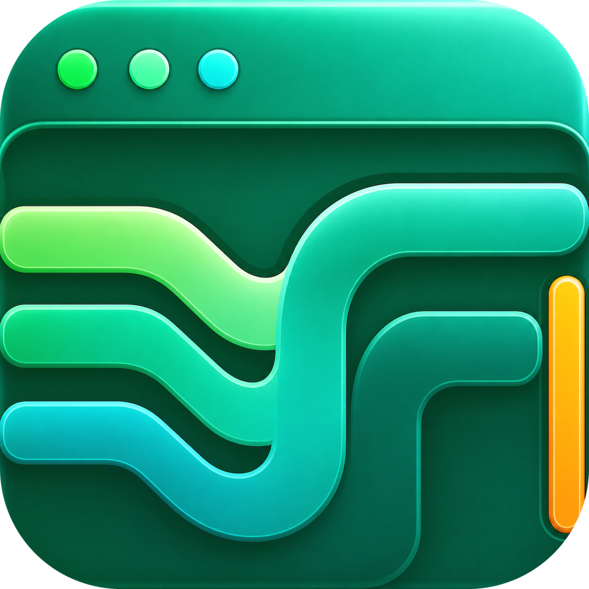

<div align="center">
  

  <h1>VoxFlow</h1>
  <p><strong>A voice keyboard and local context workbench for macOS.</strong></p>
  <p>Hold a shortcut to speak, release to insert text at the current cursor, and keep voice, screenshots, recordings, and clipboard items searchable on your Mac.</p>

  <p>
    
    
    
    
    
    <a href="https://github.com/xingbofeng/VoxFlow/actions/workflows/ci.yml"></a>
    <a href="https://github.com/xingbofeng/VoxFlow/releases/latest"></a>
    <a href="LICENSE"></a>
  </p>
  <p>
    <a href="https://mashangxie.app/">Website</a>
    &nbsp;·&nbsp;
    <a href="https://github.com/xingbofeng/VoxFlow/releases/latest">Download</a>
    &nbsp;·&nbsp;
    <a href="README.md">English</a>
    &nbsp;·&nbsp;
    <a href="README.zh-CN.md">简体中文</a>
    &nbsp;·&nbsp;
    <a href="README.zh-TW.md">繁體中文</a>
    &nbsp;·&nbsp;
    <a href="README.ja.md">日本語</a>
    &nbsp;·&nbsp;
    <a href="README.ko.md">한국어</a>
  </p>
  <p>
    <a href="docs/assets/voiceinput-demo-land.mp4"></a>
  </p>
</div>

## What VoxFlow Is

VoxFlow stays in the app you are already using. It is not a voice assistant: it does not take over your window, move you into another input box, press Enter, or submit messages for you.

It is a voice keyboard first, with a local workbench around the things you capture while working: dictation, screenshots, screen recordings, clipboard items, notes, and local coding-agent instructions.

## Core Workflows

| Workflow | Trigger | What Happens | Safety Boundary |
| --- | --- | --- | --- |
| Speak to type | Hold the dictation shortcut, speak, release | Text is inserted at the current cursor | No focus stealing, no auto-submit |
| Open the launcher | `⌥Space` | Search recent assets, actions, quicklinks, and Ask AI | Keyboard-first, Raycast-style |
| Recover local assets | Launcher or Workbench | Search voice, screenshot, recording, clipboard, and note history | Stored locally by default |
| OCR an image | Copy an image, press `⌘⇧V` | OCR text is pasted into the current field | Image-only workflow |
| Capture the screen | Press `⌘⇧A`, select a region | Review OCR, translation, summary, and the image record | Requires Screen Recording permission |
| Work with selected text | `⌘⇧F/J/K/L/P` | Translate, summarize, send to Task Assistant, or Ask AI | Uses explicit shortcuts |
| Compose for AI tools | Speak intent with window context | A prompt is copied for ChatGPT, Claude, Codex, Cursor, or similar tools | Copy only |
| Command local agents | Speak an agent name and task | Dispatch to registered Codex, Claude, CodeBuddy, or terminal-agent sessions | Registered sessions only |

## Who It Is For

- People who write, code, debug, and explain things faster by speaking than typing.
- Users who switch between ChatGPT, Claude, Codex, Cursor, terminal agents, notes, screenshots, and browser research.
- Developers who need accurate mixed Chinese-English technical dictation.
- Anyone who wants screenshots, recordings, clipboard items, and dictated text to become reusable local context.

## Highlights

- **Global dictation**: Hold to speak and release to insert text in any editable field.
- **Local asset workbench**: Dictation, screenshots, screen recordings, clipboard items, and notes become searchable assets.
- **Multiple ASR providers**: Apple Speech works out of the box; local and cloud providers are available when configured.
- **Personal corrections**: Local deterministic rules and optional conservative LLM correction help stabilize names, terms, and technical words.
- **Screenshot and clipboard OCR**: Extract text from screenshots, copied images, web pages, error dialogs, and design mockups.
- **Ask AI and Quicklinks**: The launcher can ask your configured LLM provider or search Google, GitHub, StackOverflow, YouTube, Bilibili, Taobao, JD, and more.
- **AI Coding Assistant workflows**: Compose prompts or dispatch spoken instructions to local coding-agent sessions.
- **Local-first privacy**: History and assets stay on your Mac by default; cloud ASR and LLM calls are opt-in.

## Quick Start

### Download And Install

Download the latest release from [GitHub Releases](https://github.com/xingbofeng/VoxFlow/releases/latest):

1. Open `VoxFlow-1.15.0-macOS.dmg`.
2. Drag `VoxFlow` into the `Applications` folder.
3. On first launch, if macOS cannot verify the app, Control-click the app and choose **Open**.

### Requirements

- macOS 15 Sequoia or later
- A Mac with a microphone

### First Permissions

| Permission | Why VoxFlow Needs It |
| --- | --- |
| Accessibility | Listen for global shortcuts and insert text into the current app |
| Microphone | Record your voice |
| Speech Recognition | Use Apple Speech when selected |
| Screen Recording | Read current-window context, screenshot OCR, and screen recording content |

If a shortcut does not respond after granting permissions, quit and reopen VoxFlow.

### Default Shortcuts

| Shortcut | Action |
| --- | --- |
| `⌥Space` | Open the VoxFlow launcher |
| Dictation shortcut | Hold to speak, release to insert; configurable in Settings |
| `⌘⇧V` | OCR clipboard image and paste recognized text |
| `⌘⇧A` | Capture a screen region and open the OCR result panel |
| `⌘⇧F` | Open selection actions |
| `⌘⇧J` | Translate selected text |
| `⌘⇧K` | Summarize selected text |
| `⌘⇧L` | Send selected text to Task Assistant |
| `⌘⇧P` | Send selected text to Ask AI |

## How To Use

### Dictation

1. Place your cursor in any text field.
2. Hold the dictation shortcut.
3. Speak while the overlay shows live recognition.
4. Release the shortcut. VoxFlow inserts the final text at the cursor.

### Workbench

Open the Workbench to review local history, screenshots, recordings, notes, personal corrections, models, provider settings, and AI Coding Assistant sessions.

### Screenshot And Clipboard OCR

Use `⌘⇧V` for copied images and `⌘⇧A` for a selected screen region. OCR text can be copied, spoken, translated, summarized, or reused later from the Workbench.

### Agent Workflows

Task Assistant turns visible window context plus spoken intent into a prompt. AI Coding Assistant dispatches spoken instructions to registered local coding-agent sessions.

See [Agent workflows](docs/agent-workflows.md) for setup and safety boundaries.

## Speech Models

VoxFlow supports Apple Speech out of the box, local providers such as Qwen3-ASR, Whisper, FunASR, SenseVoice, Paraformer, NVIDIA Nemotron, Parakeet, and Omnilingual, plus optional cloud providers such as Groq, Tencent Cloud, Alibaba Cloud, and future provider slots.

See [Speech models](docs/speech-models.md) for the full provider matrix.

## Privacy Summary

- Dictation history, screenshots, recordings, clipboard assets, notes, personal corrections, and non-secret settings are stored locally by default.
- LLM API keys and cloud ASR credentials are stored in the local credentials file.
- Local ASR models keep audio on-device.
- Cloud ASR sends recorded audio to the selected provider.
- LLM correction and Ask AI send text only to the provider you configure.
- Diagnostics are local by default; crash or trace upload behavior is controlled by settings.

See [Privacy and data](docs/privacy-and-data.md) and [Privacy Policy](docs/PRIVACY.md) for details.

## Documentation

| Topic | Link |
| --- | --- |
| Documentation index | [docs/README.md](docs/README.md) |
| Speech model matrix | [docs/speech-models.md](docs/speech-models.md) |
| Agent workflows | [docs/agent-workflows.md](docs/agent-workflows.md) |
| Privacy and data storage | [docs/privacy-and-data.md](docs/privacy-and-data.md) |
| Build from source | [docs/build-from-source.md](docs/build-from-source.md) |
| Third-party licenses | [docs/third-party-licenses.md](docs/third-party-licenses.md) |

## Build From Source

```bash
git clone https://github.com/xingbofeng/VoxFlow.git
cd VoxFlow
make run-dev
```

See [Build from source](docs/build-from-source.md) for commands, source layout, and development notes.

## Connect

Follow the author on X: [@Counterxing](https://x.com/Counterxing)

## WeChat And User Group

Scan the QR codes below to add the author on WeChat or join the VoxFlow user group.

<table>
  <tr>
    <td align="center">
      <strong>Add WeChat</strong><br>
      
    </td>
    <td align="center">
      <strong>Join the user group</strong><br>
      
    </td>
  </tr>
</table>
