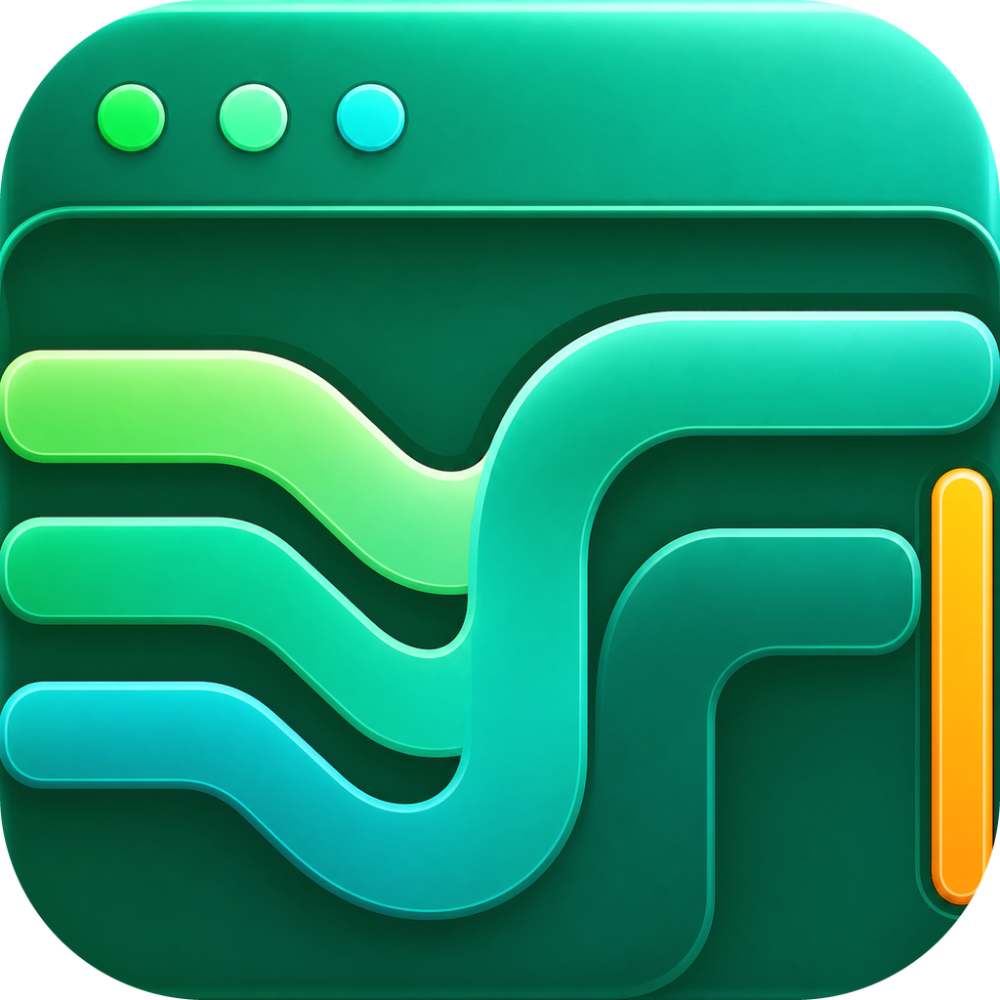
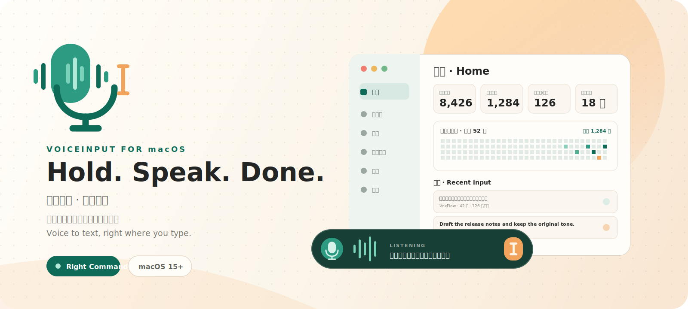

<div align="center">
  

  

  <h1>VoxFlow</h1>
  <p><strong>Hold a shortcut, speak, release — your words return to the place you were typing.</strong></p>
  <p>A native macOS menu-bar voice input tool for ideas, meetings, code explanations, and AI conversations.</p>
  <p><sub><a href="README.md">中文</a></sub></p>

  <p>
    
    <a href="https://github.com/xingbofeng/VoxFlow/releases/latest"></a>
    <a href="LICENSE"></a>
  </p>
  <p>
    🌐 <a href="https://xingbofeng.github.io/VoxFlow/">Website</a>
    &nbsp;·&nbsp;
    ⬇️ <a href="https://github.com/xingbofeng/VoxFlow/releases/latest">Download</a>
    &nbsp;·&nbsp;
    🎬 <a href="docs/voiceinput-demo-land.mp4">Intro Video</a>
  </p>
</div>


## What Is VoxFlow?

VoxFlow is a voice keyboard, not a voice assistant.

It lives in the menu bar and appears only when you want to type with your voice. Put the cursor where you want text to appear, hold the shortcut, speak, and release. VoxFlow writes the result back into the app you were already using.

It is designed for people who want speech to become text without breaking flow:

- **Faster input**: Say the thoughts you already have instead of typing every word.
- **Less interruption**: No focus stealing, no large modal workflow, no extra copy-paste step.
- **More reliable results**: Dictation, correction, glossary, styles, notes, history, and text insertion all support the same goal: getting useful text into the right place.
- **Local-first control**: Keep data on your Mac by default, then choose between system ASR, local ASR, and optional LLM correction as needed.

## Who It Is For

VoxFlow is especially useful if you:

- Talk to ChatGPT, Claude, Codex, Cursor, or other AI tools and often need to describe intent, context, or revision requests.
- Write code and frequently explain bugs, add notes, draft commit messages, or document investigation steps.
- Capture meeting notes, ideas, tasks, long replies, or article drafts.
- Speak mixed Chinese and English, where technical terms and product names are easy to misrecognize.
- Prefer quiet, native macOS utilities that live in the menu bar and stay out of the way.

## Core Experience

### Hold To Speak, Release To Insert

VoxFlow works like a keyboard layer. Hold your dictation shortcut, speak, and release. A small transcription overlay appears while you are speaking, then the final text is inserted into the current cursor position.

There is no need to switch apps or manually copy text back.

### Live Transcription

While you speak, VoxFlow shows recognized text in real time so you can stay oriented. It works for short commands, long explanations, Chinese, English, and mixed Chinese-English speech.

VoxFlow includes the system speech recognizer and also supports local ASR providers. The system model works out of the box; local Qwen3-ASR, Whisper, FunASR, and SenseVoice routes are being consolidated under a unified provider architecture for offline and privacy-focused workflows. The Models page now labels streaming capability explicitly; providers that do not currently support real-time streaming, such as Whisper, SenseVoice, and Groq Whisper, are marked as **Non-streaming** and return their final result after recording finishes.

### Optional LLM Correction

Speech recognition can struggle with technical terms such as Python, JSON, TypeScript, framework names, or product names. VoxFlow can run a conservative correction pass through your own OpenAI-compatible provider after dictation finishes.

The correction pass is intentionally restrained. It is meant to fix obvious recognition mistakes, not rewrite your tone or polish your content.

### Workbench

VoxFlow also includes a workbench for the parts of voice input that deserve a proper home:

| Page | What You Can Do |
| --- | --- |
| Home | Review stats, daily goals, and dictation history; copy or delete entries |
| Glossary | Manage frequent terms, names, technical words, and replacement rules |
| Styles | Choose output styles such as original, formal, email, or coding notes |
| File Transcription | Import audio or video files, transcribe them, export txt/md/srt, or save as notes |
| Notes | Record voice notes, edit Markdown, search, and review recent notes |
| Settings | Manage input devices, shortcuts, models, permissions, privacy, and data |
| Help | Find permission guidance, version information, and project links |

## Highlights

- **Global dictation**: Works in any editable text field, not only inside VoxFlow.
- **Non-intrusive overlay**: Shows live text and voice activity without taking focus.
- **Multiple ASR providers**: Start with the built-in system recognizer; local Qwen3-ASR, Whisper, FunASR, and SenseVoice providers are being unified under the same runtime model; providers without real-time streaming are marked as **Non-streaming** in Models.
- **Stable text insertion**: Temporarily switches input source before paste, then restores both input source and clipboard to reduce CJK input-method interference.
- **Input device selection**: Choose your microphone; long device names are handled gracefully.
- **Shortcut recording**: Record the key you want to use and configure short-press behavior.
- **OpenAI-compatible providers**: Add, test, edit, and delete providers; API keys are stored in macOS Keychain.
- **Glossary and replacements**: Teach VoxFlow your own terms, aliases, and fixed transformations.
- **History and notes**: Search, copy, edit, and reuse previous dictation results.
- **File transcription**: Turn recordings, videos, or meeting audio into text.
- **Local-first data**: History, glossary, settings, notes, and jobs live locally; LLM correction is opt-in.

## Quick Start

### Download & Install

Download the latest version from [GitHub Releases](https://github.com/xingbofeng/VoxFlow/releases/latest):

1. Open `VoxFlow-1.2.0-macOS.dmg`
2. Drag `VoxFlow` into the `Applications` folder
3. On first launch, if macOS cannot verify the app, Control-click the app and choose **Open**

### Requirements

- macOS 14 Sonoma or later
- A Mac with a microphone

### First Permissions

VoxFlow needs a few macOS permissions:

| Permission | Why It Is Needed | Where |
| --- | --- | --- |
| Accessibility | Listen for the global shortcut and insert text into the current app | System Settings -> Privacy & Security -> Accessibility |
| Microphone | Record your voice | System Settings -> Privacy & Security -> Microphone |
| Speech Recognition | Use the system speech recognizer | System Settings -> Privacy & Security -> Speech Recognition |
| Screen Recording | OCR the current window for Agent Compose; screenshots are not persisted | System Settings -> Privacy & Security -> Screen Recording |

If you use a local Qwen3-ASR model, Speech Recognition permission is not required. Microphone permission is still required.

If the shortcut does not respond after granting permissions, quit and reopen VoxFlow.

## How To Use

### Dictation

1. Place your cursor in any text field.
2. Hold the dictation shortcut.
3. Speak. The overlay shows live recognition.
4. Release the shortcut. The final text is inserted at the cursor.

### Voice Notes

Open the workbench and go to **Notes**. Click the record button to start a quick note. VoxFlow transcribes as you speak, then lets you edit and review the note afterward.

### File Transcription

Open **File Transcription**, select an audio or video file, and let VoxFlow process it. Completed jobs can be copied, exported, or saved as notes.

### Improve Names And Terms

Use **Glossary** to add project names, people names, product names, technical terms, or fixed replacements. These entries help future dictation and correction feel closer to your own vocabulary.

### Enable LLM Correction

Open **Settings -> Models**, add an OpenAI-compatible provider, fill in Base URL, Model, and API Key, then test the connection. Once it works, enable **LLM Correction** in the same settings page.

API keys are stored in macOS Keychain.

## Privacy

VoxFlow is local-first by default.

- History, glossary, notes, transcription jobs, and non-secret settings are stored locally.
- API keys are stored in macOS Keychain.
- Apple Speech may process audio according to macOS system behavior.
- Local Qwen3-ASR runs on-device after the model is downloaded.
- LLM correction is disabled by default. When enabled, only recognized text is sent to your configured API provider.
- VoxFlow does not automatically upload your audio, notes, history, or clipboard content.

See [Privacy](docs/PRIVACY.md) for more details.

## FAQ

| Question | Answer |
| --- | --- |
| The shortcut does nothing | Check Accessibility permission, then quit and reopen VoxFlow |
| The overlay appears but no text shows up | Check Microphone, Speech Recognition, or the selected model state |
| LLM correction does not run | Make sure it is enabled in Settings and the default provider passes the connection test |
| Why is my API key hidden? | That is expected. Use the reveal button while editing if you need to inspect it |
| Can I use it offline? | Download and select a local Qwen3-ASR model |
| Can deleted history or notes be restored? | Deletion is local and immediate, so please confirm before deleting |

## Run From Source

If you want to build the app yourself:

```bash
git clone https://github.com/xingbofeng/VoxFlow.git
cd VoxFlow
make run-dev
```

Common commands:

```bash
make run-dev      # Daily development: Debug + native arch, package and launch .app
make run-native   # Native Release for local checks close to shipped behavior
make build        # Universal Release: arm64 + x86_64, used for release/DMG
make install      # Install into /Applications
swift test        # Run tests
```

## Inspiration

This project is inspired by [yetone/voice-input-src](https://github.com/yetone/voice-input-src). Thanks for their pioneering work.
