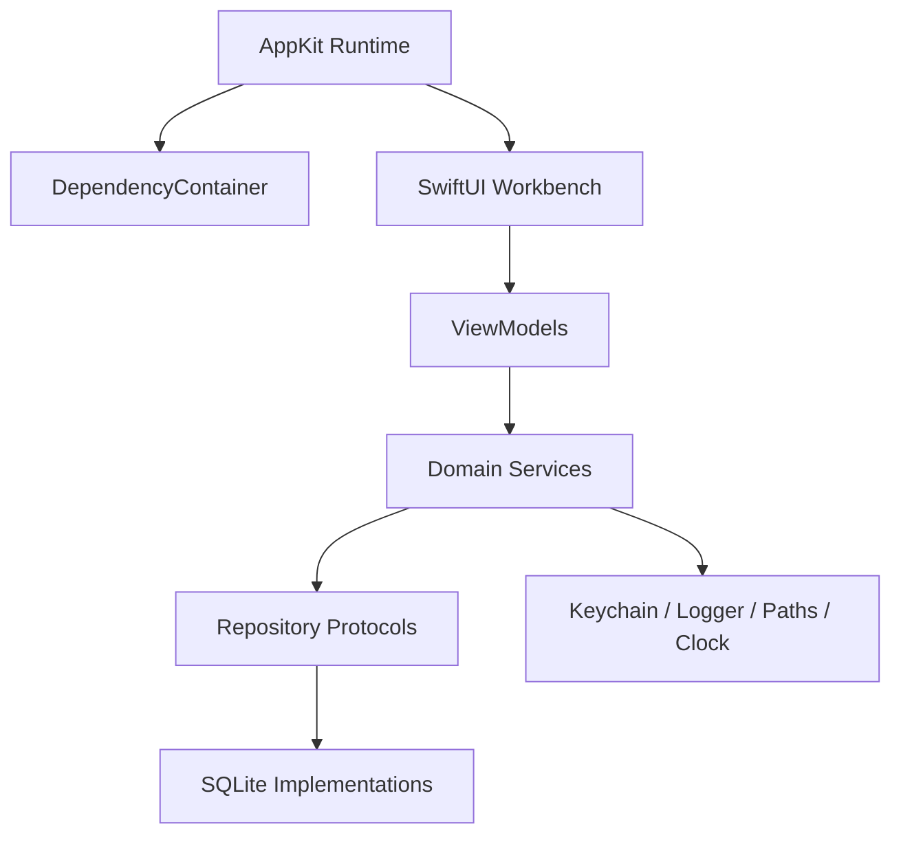

# VoxFlow Architecture

## Module Boundaries

| Module | Owns | Must not own |
| --- | --- | --- |
| `AppDelegate` | App lifecycle, menu items, hotkey start/finish flow | Database SQL, Keychain details, SwiftUI page logic |
| `WindowCoordinator` | Opening main workbench and settings windows | Dictation state, recording, injection |
| `MainWindowController` | AppKit host for SwiftUI workbench | Repository queries |
| `MainShellView` / `SidebarView` | Navigation shell and page routing | Business logic or persistence |
| `WorkbenchViewModel` | Workbench summary data loading | SQL, AppKit window management |
| `DependencyContainer` | Building live/test dependency graph | UI rendering |
| `SQLite*Repository` | Persistence for one table/domain | Networking, ASR/LLM execution, UI state |
| `CredentialStore` | Secret persistence | Non-sensitive preferences |
| `TextInjector` | Input source switching and pasteboard restore | Recognition or LLM calls |
| `OverlayWindowController` | Non-activating HUD | Main workbench lifecycle |

## Dependency Direction

## Runtime Rules

- HUD remains non-activating.
- Main window activates only when the user explicitly opens it from the menu.
- Settings and workbench must not be required for the core menu bar dictation loop.
- API keys must never be logged, exported, stored in SQLite, or stored in UserDefaults.

