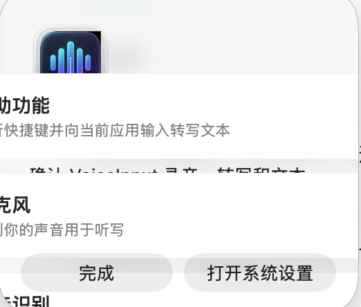
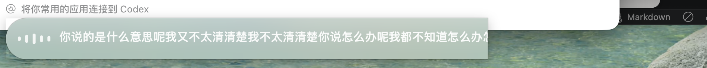
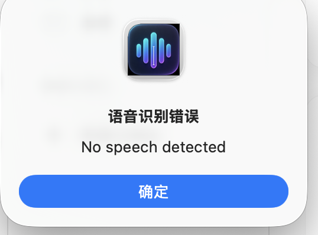
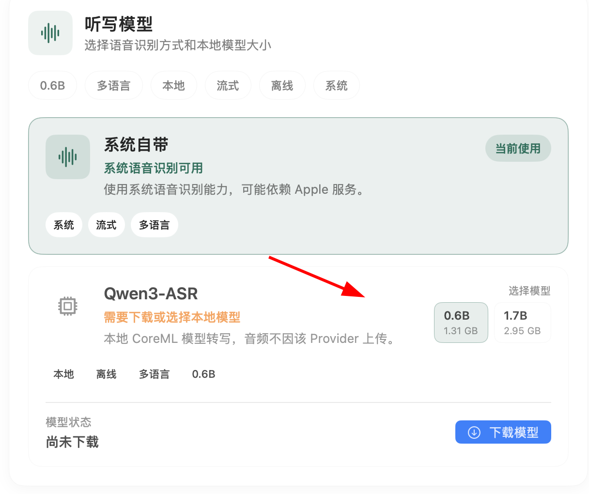
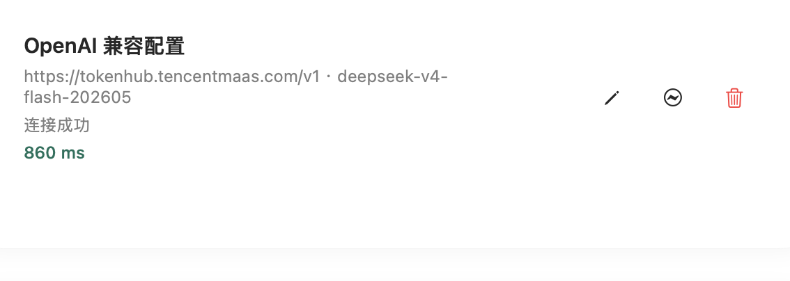
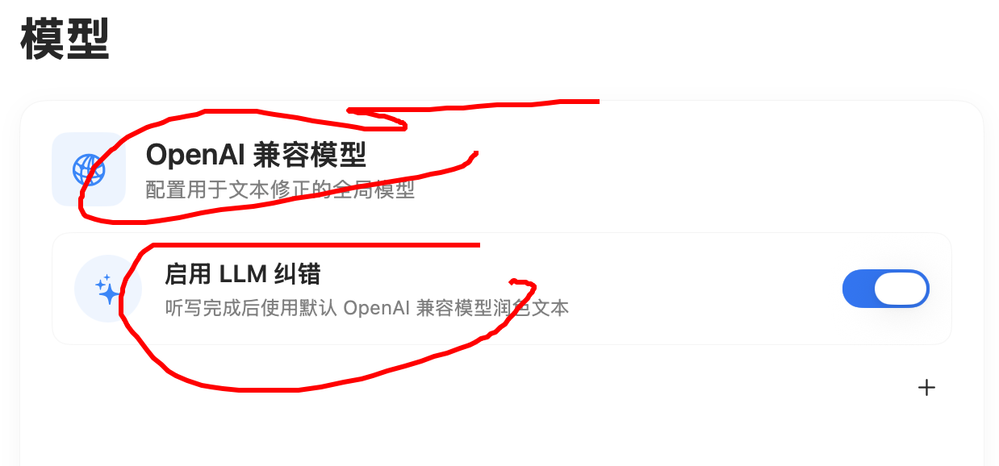

# 2026-06-13 用户反馈问题清单

## 背景

本清单整理 2026-06-13 用户对 VoiceInput macOS App 的集中反馈。目标是把原始反馈拆成后续可实现、可验收、可回归测试的问题项，并保留参考截图。

状态说明：

- `待修复`：尚未处理。
- `待设计确认`：需要先确认交互或视觉规则再实现。
- `待复查`：需要全项目范围检查，可能拆出子任务。

优先级说明：

- `P0`：明显阻断或非常影响体验。
- `P1`：核心流程体验问题。
- `P2`：样式一致性、可维护性或非阻断问题。

## 2026-06-13 处理结果

本轮遵循“保留功能和页面布局，只修样式与明确缺陷”的范围。验证结果中的“实测”指使用构建后的 macOS App 检查，“测试”指 Swift 自动化测试，“静态”指代码路径与持久化检查。

| # | 结果 | 验证 |
| --- | --- | --- |
| 1 | 已修复：权限引导改为自定义 SwiftUI 面板，按权限项动态计算高度，统一按钮和状态样式 | 实测单权限状态无裁切，按钮与“右 Option”文案正常 |
| 2 | 已修复：状态栏使用 template SF Symbol，并根据灰色图标设置刷新 tint | 静态、构建 |
| 3 | 已修复：重新生成全部 iconset 尺寸和 icns，清除不透明角 | `AppIconAssetTests` 检查四角透明 |
| 4 | 已修复：HUD 限宽、支持多行、限制最大高度，错误状态不再重置尺寸和波形可见性 | `OverlayLayoutTests`、静态 |
| 5 | 已修复：识别错误改为非阻断 HUD，保留原始或部分文本回退 | 测试、静态 |
| 6 | 已修复：仅当笔记编辑器实际获得焦点时接管全局快捷键 | `NotesCaptureCoordinatorTests`、实测笔记页 |
| 7 | 已修复：模型卡片整卡可点击，模型尺寸和标签控件扩大命中区域 | 实测模型页、静态 |
| 8 | 已修复：本轮涉及的图标按钮统一为至少 32 x 32 pt，并补充控件表面反馈 | 实测主要页面、静态 |
| 9 | 已修复：编辑请求改用 `.sheet(item:)`，回填 URL、Model、API Key 状态和启用状态 | `LLMProviderViewModelTests`、实测进入编辑凭据读取路径 |
| 10 | 已修复：统一模型页卡片、图标、操作区和说明文本的视觉层级 | 实测模型页 |
| 11 | 已修复：开始提示音先播放再静音，结束/失败先恢复输出再播放提示音；增强开关接入录音缓冲处理 | `RecordingAudioFeedbackControllerTests`、`AudioRecorderTests`、CoreAudio 构建 |
| 12 | 已复查：设置持久化、快捷键、权限跳转、提示音、录音静音和语音增强已接入真实运行路径 | `SettingsViewModelTests`、实测设置/权限；未在自动化中改变系统权限或实际扬声器音量 |
| 13 | 已修复：快捷键图标和文本统一由 `KeyCodeMapping` 生成 | `KeyCodeMappingTests`、实测“右 Option” |
| 14 | 已修复：帮助页读取当前快捷键配置 | 实测默认快捷键；隔离测试包实测“右 Option”权限文案 |
| 15 | 已修复：侧栏展开/收起改为轻量系统色样式 | 实测 |
| 16 | 已修复：六个内置风格改为结构化 Markdown，并仅迁移精确匹配的旧默认文本 | `StyleViewModelTests`、实测旧数据迁移 |
| 17 | 未复现：当前文件转写空状态没有可编辑输入光标，结果区为可选择的只读文本 | 实测文件转写页、静态 |
| 18 | 已修复：添加按钮使用明确的强调色、正常/禁用对比和完整命中区域 | 实测 |
| 19 | 已完成本轮范围：统一主题 token、卡片、输入框、按钮、选中态、空状态和主要页面间距 | 实测首页、词汇表、风格、文件转写、笔记、设置、帮助 |
| 20 | 暂缓：目录重组会产生大量文件移动，不属于“只改样式、不改布局和功能”的低风险范围 | 需单独确认移动清单后实施 |

额外修复：主窗口显示后会复查多屏位置。跨屏窗口实测从 `755, 33` 自动校正到主屏内的 `206, 101`，窗口尺寸保持 `1100 x 752`。

## 参考截图索引

| 编号 | 说明 | 截图 |
| --- | --- | --- |
| 图 1 | 权限弹窗样式、裁切和底部按钮问题 |  |
| 图 2 | 状态栏图标当前为黑色 |  |
| 图 3 | 添加按钮样式与可点击状态参考 |  |
| 图 4 | App logo/icon 边缘不透明 |  |
| 图 5 | 笔记页面录音输入区域参考 |  |
| 图 6 | 当前录音浮层问题：内容过长、未换行、样式不符合预期 |  |
| 图 7 | 目标录音浮层样式参考 |  |
| 图 8 | 当前语音识别错误弹窗 |  |
| 图 9 | 听写模型点击区域问题 |  |
| 图 10 | 大模型配置卡片、编辑入口和对齐问题 |  |
| 图 11 | 模型页面信息块对齐问题 |  |
| 图 12 | 录制快捷键显示为右 Option，但 icon 仍是 Command |  |
| 图 13 | 展开/收起按钮样式不应使用深绿色底 |  |

## 问题列表

### 1. 权限弹窗样式异常

- 优先级：P1
- 状态：待修复
- 参考截图：图 1
- 当前问题：权限引导弹窗内容被裁切，顶部 logo 与文本区域位置异常，底部按钮视觉仍像默认控件，整体不符合 mac 简洁风格。
- 期望表现：弹窗内容完整可见，标题、说明、权限项、按钮布局清晰；按钮样式统一，视觉上更像 App 内自定义控件。
- 验收点：不同权限状态下弹窗不裁切；窗口宽高、圆角、按钮间距稳定；`完成` 和 `打开系统设置` 都能正常点击并触发正确行为。

### 2. 状态栏图标需要白色

- 优先级：P1
- 状态：待修复
- 参考截图：图 2
- 当前问题：状态栏麦克风图标仍是黑色。
- 期望表现：状态栏图标使用白色或 template image 自动适配深浅菜单栏，在当前场景下呈现白色。
- 验收点：浅色、深色、透明菜单栏场景下均可辨识；激活、录音、空闲状态的图标颜色符合设计。

### 3. App logo/icon 边缘不透明

- 优先级：P1
- 状态：待修复
- 参考截图：图 4
- 当前问题：App logo/icon 看起来仍不是透明背景，边缘有明显底色或描边残留。
- 期望表现：图标边缘透明干净，放在弹窗、Dock、状态栏附近都没有脏边。
- 验收点：检查 `Resources/AppIcon.png`、`.icns`、`iconset` 及 App 内显示用图片；所有尺寸导出后边缘无白边、灰边或背景块。

### 4. 录音浮层未按图 7 样式实现

- 优先级：P0
- 状态：待修复
- 参考截图：图 6、图 7
- 当前问题：当前录音浮层更像横向长条，长文不会合理换行，文本溢出到屏幕边缘，视觉与图 7 目标样式不一致。
- 期望表现：录音浮层使用图 7 的半透明玻璃拟态胶囊样式，居中或贴近目标位置展示；文本区域支持长文自动换行，并设置最大高度。
- 验收点：短句、长句、多行中文、英文混排都能展示；超过最大高度后内部滚动或渐隐处理；浮层不遮挡系统菜单，不超出屏幕安全区域；录音波形、文字、背景层级清楚。

### 5. 语音识别错误不应弹系统弹窗

- 优先级：P0
- 状态：待修复
- 参考截图：图 8
- 当前问题：出现 `语音识别错误 / No speech detected` 的阻断式弹窗，用户体验很糟糕。
- 期望表现：无语音、识别失败、网络或模型错误应使用非阻断反馈，例如 HUD 状态、轻提示、日志或设置页诊断，不应打断用户。
- 验收点：`No speech detected` 不再弹出模态确认框；如果已有部分识别文本，优先保留或提交部分结果；错误信息可追踪但不阻断下一次录音。

### 6. 笔记页面录音触发逻辑不完整

- 优先级：P1
- 状态：待修复
- 参考截图：图 5
- 当前问题：笔记页面似乎只有点击右侧录音按钮才开始录音；当光标在文本框中时，按全局录音按钮没有进入笔记录音流程。
- 期望表现：在笔记界面，只要光标位于笔记输入框内，按录音快捷键或录音按钮都应开始录音，并将转写内容写入当前光标位置。
- 验收点：焦点在笔记输入框时，全局录音入口、页面录音按钮和快捷键行为一致；录音完成后内容进入当前编辑器，不误注入到其他 App。

### 7. 听写模型点击区域异常

- 优先级：P1
- 状态：待复查
- 参考截图：图 9
- 当前问题：听写模型页面的模型选择区域点击命中范围不符合预期，用户标注的位置可能点击不到或点击反馈不清晰。
- 期望表现：模型卡片、尺寸选项、下载按钮、标签筛选都有清晰且足够大的点击区域；点击区域与视觉边界一致。
- 验收点：`系统自带`、`Qwen3-ASR`、`0.6B`、`1.7B`、`下载模型` 等元素均可通过点击视觉区域触发；hover、pressed、selected 状态清楚。

### 8. 全项目点击区域需要统一复查

- 优先级：P1
- 状态：待复查
- 参考截图：图 3、图 9、图 10、图 11、图 13
- 当前问题：多个页面存在点击区域与视觉区域不一致、按钮点击范围过小、图标按钮无明确 hit area 的问题。
- 期望表现：按钮、卡片、分段控件、开关、图标按钮、展开收起入口的点击范围统一，符合 macOS 桌面端使用习惯。
- 验收点：最小点击区域建议不小于 32 x 32 pt；图标按钮有明确背景或 hover 反馈；禁用态按钮不可点击且视觉明确；卡片可点击时整卡或指定区域规则一致。

### 9. 大模型配置编辑未自动填充

- 优先级：P1
- 状态：待修复
- 参考截图：图 10
- 当前问题：大模型配置已存在，但点击修改时没有自动填充已有 endpoint、model、状态等配置内容。
- 期望表现：进入编辑状态时自动带出当前配置，用户只需修改变化项。
- 验收点：编辑入口打开后，Base URL、Model、API Key 状态、启用状态等已有配置正确回填；保存、取消、测试连接行为不丢失旧配置。

### 10. 大模型页面对齐和信息层级异常

- 优先级：P2
- 状态：待修复
- 参考截图：图 10、图 11
- 当前问题：大模型配置卡片、模型页标题区和功能说明存在对齐不齐、信息层级不清的问题。
- 期望表现：页面标题、说明、卡片左侧 icon、正文、操作按钮和状态文本按统一栅格对齐。
- 验收点：`OpenAI 兼容模型`、`启用 LLM 纠错`、编辑/测试/删除按钮之间间距一致；长 URL 和长模型名换行后不破坏布局。

### 11. 静音和音频反馈提示音按钮未生效

- 优先级：P1
- 状态：待修复
- 参考截图：无单独截图，归入系统设置复查
- 当前问题：录音时静音和音频反馈提示音开关看起来没有起作用。
- 期望表现：相关开关应明确控制录音开始、结束、错误、成功等提示音，以及录音过程是否静音。
- 验收点：开关状态持久化；重新打开设置仍正确；实际录音流程能按配置播放或关闭提示音；失败路径也遵循配置。

### 12. 系统设置页功能需要逐项验证

- 优先级：P1
- 状态：待复查
- 参考截图：图 1、图 12
- 当前问题：用户要求检查系统设置里的选项是否真的起作用。
- 期望表现：系统设置页每个开关、按钮、快捷键录制、权限跳转、声音反馈、模型选择都能触发真实行为。
- 验收点：列出设置项清单；逐项验证 UI 状态、持久化、运行时效果；区分真实验证、静态检查、因系统权限无法验证的项。

### 13. 录制快捷键 icon 与实际按键不一致

- 优先级：P1
- 状态：待修复
- 参考截图：图 12
- 当前问题：快捷键已录制为右 Option，但页面 icon 仍显示 Command。
- 期望表现：icon 与当前快捷键一致。右 Option 应显示 Option 符号或对应自定义图标，不应继续显示 Command。
- 验收点：右 Option、右 Command、其他支持按键分别显示正确 icon 和文本；重新录制后立即刷新；重启 App 后仍正确。

### 14. 帮助菜单仍显示右 Command

- 优先级：P2
- 状态：待修复
- 参考截图：图 12
- 当前问题：帮助菜单仍提示右 Command，与当前录制的右 Option 不一致。
- 期望表现：帮助菜单文案应读取当前快捷键配置，或使用不绑定具体按键的通用描述。
- 验收点：快捷键更改后帮助菜单同步显示；默认值、用户自定义值和异常值都有合理文案。

### 15. 展开/收起按钮不应使用深绿色底

- 优先级：P2
- 状态：待修复
- 参考截图：图 13
- 当前问题：展开/收起入口使用了深绿色底色，和整体 mac 简洁风格不一致。
- 期望表现：使用轻量、低干扰的 macOS 风格按钮，例如浅灰底、透明 hover、outline 或文本按钮。
- 验收点：展开、收起、hover、pressed、disabled 状态一致；不再出现深绿色重色块。

### 16. 风格转写 Markdown 需要重新全面撰写

- 优先级：P2
- 状态：待设计确认
- 参考截图：无单独截图
- 当前问题：风格转写区域的 Markdown 内容不够完整，需要重新写得更全面。
- 期望表现：风格转写说明应覆盖用途、使用方式、示例、边界、常见问题和与 LLM 纠错的关系；文案应清晰但不冗长。
- 验收点：Markdown 有完整结构；用户能理解如何添加/选择风格、如何作用于不同 App、何时不会改写；内容不与实际功能冲突。

### 17. 文件转写光标仍然歪

- 优先级：P2
- 状态：待修复
- 参考截图：无单独截图
- 当前问题：文件转写页面的光标或输入光标位置仍然偏斜，视觉上不对齐。
- 期望表现：文件转写相关输入框或文本区域的光标与文字基线、内边距、行高保持一致。
- 验收点：空输入、中文、英文、多行输入时光标都垂直居中或贴合文本基线；不同字号下不偏移。

### 18. 添加按钮样式需要调整

- 优先级：P2
- 状态：待修复
- 参考截图：图 3
- 当前问题：添加按钮颜色偏淡，像禁用态；按钮文字和加号对比不足。
- 期望表现：启用态、禁用态、hover、pressed 状态清晰区分；当前可点击时不应像禁用态。
- 验收点：按钮状态与实际可点击性一致；文字和 icon 对比度足够；点击区域覆盖完整按钮。

### 19. 全项目视觉风格需要统一成 mac 简洁风格

- 优先级：P2
- 状态：待复查
- 参考截图：图 1、图 3、图 5、图 9、图 10、图 11、图 13
- 当前问题：input、button、card、toggle、图标按钮等控件仍有默认控件感，整体视觉不够精致统一。
- 期望表现：建立统一的 macOS 简洁风格组件规则，包括输入框、按钮、卡片、列表、分段控件、标签、状态徽标、空状态和错误提示。
- 验收点：主要页面使用统一间距、圆角、颜色、字号和状态反馈；默认系统样式只在符合设计时保留；禁用态、错误态、加载态一致。

### 20. 源码和测试目录需要分层

- 优先级：P2
- 状态：待设计确认
- 参考截图：无单独截图
- 当前问题：当前 `Sources/VoiceInputApp` 和 `Tests/VoiceInputAppTests` 文件较多，用户认为源码和测试目录没有分层。
- 期望表现：按模块边界重组目录，例如 App、Dictation、ASR、LLM、Notes、Settings、Persistence、UI、Utilities 等；测试目录按同样模块镜像组织。
- 验收点：迁移方案先列出文件移动清单和兼容风险；保持 SwiftPM target 可构建；测试文件路径与被测模块对应；不改变公共行为。

## 横向复查清单

- 权限和系统设置：权限弹窗、系统设置跳转、设置项持久化、设置项运行时效果。
- 录音流程：状态栏录音、笔记录音、HUD 录音、提示音、静音、错误反馈、长文本显示。
- 模型配置：听写模型选择、下载、模型尺寸切换、大模型配置新增、编辑、删除、测试连接。
- 样式系统：按钮、输入框、卡片、图标、标签、分段控件、展开收起、禁用态、hover/pressed 状态。
- 点击区域：所有按钮、卡片、图标按钮、开关、列表项、模型尺寸选项和帮助菜单入口。
- 文档和结构：风格转写 Markdown、源码目录分层、测试目录分层、后续实施说明。

## 建议拆分顺序

1. 先修 P0：录音浮层、语音识别错误弹窗。
2. 再修 P1 核心交互：笔记录音、状态栏图标、快捷键显示、LLM 编辑回填、模型点击区域、设置项生效。
3. 然后统一 P2 视觉：按钮、输入框、卡片、展开收起、权限弹窗细节。
4. 最后做结构性改造：源码和测试目录分层，迁移前需单独确认文件清单。
