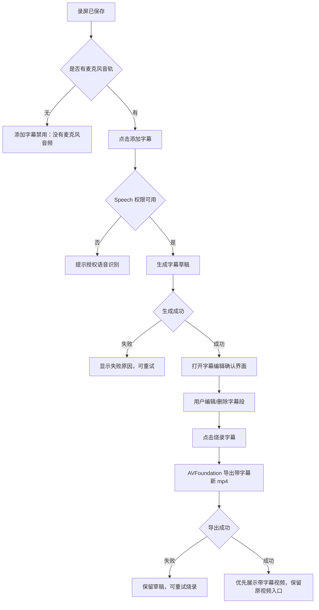

# 录屏字幕 V1 交互稿与设计稿

日期：2026-06-27

## 范围

V1 只做系统自带字幕链路：

- 使用系统 Speech framework 从麦克风音轨生成带时间轴的字幕草稿。
- 使用 AVFoundation 将用户确认后的字幕烧录为新 mp4。
- 不改默认 ASR provider，不引入 FFmpeg，不做实时字幕。
- 原始录屏永远保留；带字幕视频始终是新文件。

## 总流程



## 右下角完成 HUD

用途：录屏刚结束后的轻量完成面板。它不是完整编辑器，只负责确认保存、播放预览和进入后续动作。

默认态：

```text
+------------------------------------------------+
| 录屏已保存                                [x] |
|                                                |
| +--------------------------------------------+ |
| |                                            | |
| |              视频预览 / 播放控件           | |
| |                                            | |
| +--------------------------------------------+ |
|                                                |
| [打开] [复制] [下载] [Finder] [删除] [字幕]   |
+------------------------------------------------+
```

设计约束：

- 底部动作使用固定尺寸图标按钮，避免本地化文本换行。
- 每个按钮必须有 tooltip/help。
- `添加字幕` 只在 `audioMode == microphone` 时启用。
- 无麦克风音轨时禁用字幕按钮，help：`这段录屏没有麦克风音频，无法添加字幕`。

字幕相关状态：

```text
none          [字幕]
generating    [生成中...]  禁用，显示进度/转圈
draftReady    [字幕]       点击打开字幕编辑确认界面
burning       [烧录中...]  禁用，显示进度
burned        [带字幕]     点击打开带字幕视频
failed        [重试字幕]   点击重新生成字幕
```

## 录屏详情栏

用途：多媒体历史中的完整管理入口。详情页比 HUD 更适合展示字幕状态、失败原因和文件信息。

默认结构：

```text
+------------------------------------------------------------------+
| 录屏详情                                                     [x] |
+-----------------------------------------------+------------------+
|                                               | 元信息           |
|                                               | 时间  6月27日    |
|              视频播放器                       | 时长  00:05      |
|                                               | 分辨率 752x704   |
|                                               | 文件大小 595 KB  |
|                                               | 声音  麦克风     |
|                                               | 收藏  未收藏     |
|                                               |                  |
|                                               | 字幕             |
|                                               | 状态  未添加     |
|                                               | [添加字幕]       |
+-----------------------------------------------+------------------+
| [打开] [复制] [Finder] [收藏] [删除]                              |
+------------------------------------------------------------------+
```

状态变化：

- `未添加`：显示 `添加字幕`。
- `生成中`：显示进度文案，按钮禁用，可关闭详情页，后台继续。
- `草稿待确认`：显示 `查看/编辑字幕`、`烧录字幕`。
- `烧录中`：显示导出进度，禁用删除草稿。
- `已烧录`：显示 `打开带字幕视频`、`查看原视频`、`查看/编辑字幕`。
- `失败`：显示错误摘要、`重试`。

## 字幕编辑确认界面

用途：用户确认字幕内容，避免识别错误直接进入烧录。

建议作为独立 sheet/panel 打开，不挤在详情栏里。

```text
+------------------------------------------------------------------------+
| 添加字幕                                                        [关闭] |
+---------------------------------------------+--------------------------+
|                                             | 字幕草稿                 |
|                                             |                          |
|              视频预览                       | 00:00.4 - 00:02.1       |
|              可播放定位                     | [ 这里是第一句字幕    ] |
|                                             | [删除]                   |
|                                             |                          |
|                                             | 00:02.1 - 00:04.8       |
|                                             | [ 这里是第二句字幕    ] |
|                                             | [删除]                   |
|                                             |                          |
+---------------------------------------------+--------------------------+
| 字幕样式：底部居中 / 白字 / 黑色半透明底                         |
|                                      [取消] [保存草稿] [烧录字幕] |
+------------------------------------------------------------------------+
```

V1 编辑能力：

- 修改每段字幕文字。
- 删除段落。
- 播放视频时可查看字幕段对应时间。
- 暂不支持拖拽时间轴、合并、拆分、改样式。

烧录确认：

```text
生成带字幕视频？

将生成一个新的 mp4，原始录屏会保留。

[取消] [生成带字幕视频]
```

## 字幕样式

V1 固定样式：

- 位置：视频底部居中，距离底部约 8% 视频高度。
- 文字：白色，半粗体。
- 背景：黑色半透明圆角底，或黑色描边。优先半透明底，移动画面上更稳定。
- 行数：最多 2 行；超长文本按字幕区域宽度换行。
- 安全区：左右各留 8% 视频宽度。

## 数据状态

建议字段：

- `subtitle_status`: `none | generating | draftReady | burning | burned | failed`
- `subtitle_draft_path`: 字幕草稿 JSON 路径
- `subtitle_srt_path`: 导出的 SRT 路径
- `subtitled_video_path`: 带字幕 mp4 路径
- `subtitle_error_message`: 最近一次失败原因
- `subtitle_updated_at`: 字幕状态更新时间

草稿 JSON 用于编辑和烧录；SRT 用于外部兼容。

## 异常与取消

- 无麦克风音轨：不允许添加字幕。
- Speech 权限缺失：提示授权，不修改视频记录。
- 生成字幕失败：原视频可继续打开，状态为 `failed`，可重试。
- 烧录失败：保留字幕草稿，可重试烧录。
- 用户取消生成字幕：状态回到 `none`。
- 用户取消烧录：状态回到 `draftReady`。
- 删除录屏记录：一并删除字幕 JSON、SRT、带字幕视频。

## 验收标准

- 录屏完成 HUD 不再出现底部按钮文字换行。
- 无麦克风录屏不会进入字幕生成。
- 有麦克风录屏可以从 HUD 和详情页进入添加字幕。
- 字幕生成完成后必须经过编辑确认界面，不能自动烧录。
- 烧录生成新 mp4，不覆盖原视频。
- 失败和取消不污染原视频。
- 详情页能区分原视频与带字幕视频。

