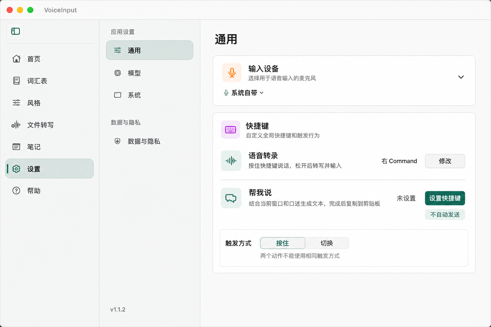
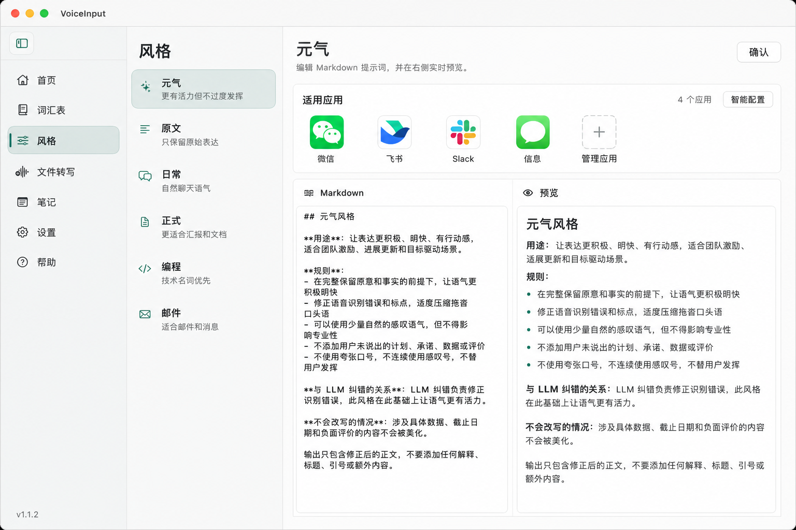
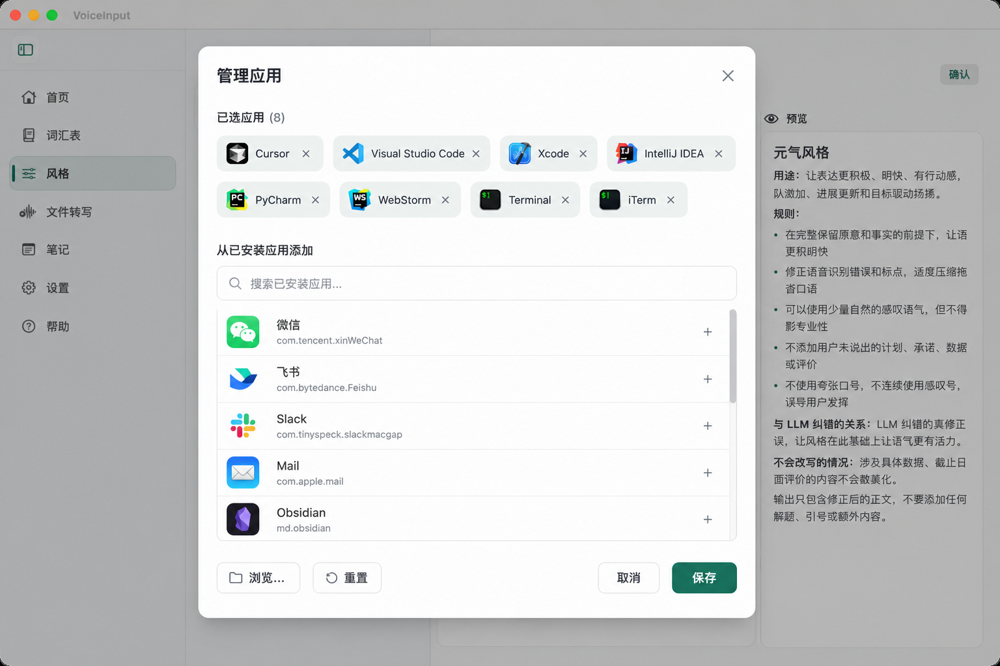
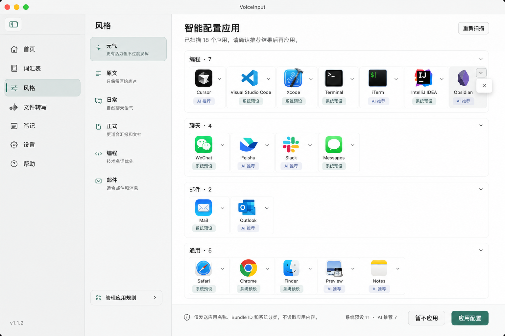

# Proposal: 应用路由、可靠语音任务与全应用“帮我说”

**Change ID:** `add-context-aware-voice-workflows`
**Created:** 2026-06-14
**Status:** Implemented

---

## Why

VoxFlow 已经能完成语音转录和可选 LLM 纠错，但应用风格配置成本高、处理过程缺少阶段性恢复，也不能利用当前窗口上下文执行“帮我回复或生成文本”一类任务。现在需要把应用路由、可靠任务和上下文生成统一为一条可持久化语音工作流，为后续扩展应用适配和自动化能力建立安全基础。

## What Changes

- 扫描本机已安装应用，用内置注册表和可确认的 LLM 推荐建立应用风格规则。
- 新增持久化 VoiceTask，在录音、转写、上下文、生成和输出阶段及时保存结果并支持恢复。
- 新增面向所有前台应用的“帮我说”模式，结合当前窗口上下文和用户口述生成文本。
- 把快捷键扩展为“语音转录”和“帮我说”两个动作绑定，并阻止冲突。
- 普通转录继续安全注入；“帮我说”第一版只复制结果，不自动注入或发送。
- 首页现有历史详情扩展为上下文预览、失败诊断和恢复入口。

## Capabilities

### New Capabilities

- `application-style-routing`: 已安装应用扫描、内置注册表、LLM 风格推荐、确认和运行时规则优先级。
- `reliable-voice-tasks`: VoiceTask 持久化、阶段状态、目标窗口保护、失败降级和恢复操作。
- `agent-compose`: 全应用上下文采集、Agent Prompt、快捷键动作和只复制输出。

### Modified Capabilities

- 无。仓库此前没有 OpenSpec 基线 capability；现有行为的兼容要求包含在上述新 capability 的 MODIFIED Requirements 中。

## Impact

- 影响 SQLite migration、录音编排、文本处理、应用风格规则、快捷键、Accessibility/屏幕录制权限、剪贴板、HUD、风格页和首页详情。
- 不新增外部服务或三方依赖；继续使用用户已有的 OpenAI-compatible LLM Provider。
- 不改变 API key 的 Keychain 存储。
- 不包含破坏性用户数据变更；现有历史和快捷键需要兼容迁移。

## 背景

VoxFlow 当前已经具备按住快捷键录音、ASR 转写、可选 LLM 纠错、按应用选择风格、文本粘贴和首页历史记录等能力。但现有链路仍有三个明显缺口：

1. 应用风格规则主要依赖用户手工输入 Bundle ID，用户首次配置 LLM 后无法快速为本机应用建立合理的风格路由。
2. 一条输入只有在完整流程结束后才进入历史记录。若 ASR、LLM、注入或应用本身中途失败，已获得的音频、原始转写或生成文本可能无法恢复。
3. 当前语音输入以“把口述转成文本”为主，不能把当前窗口内容作为上下文，让 LLM 根据“帮我回这条消息”“根据当前内容写一封回复”等指令生成可用文本。

这三个问题属于同一条语音任务链：应用路由决定如何处理，任务持久化保证任何阶段的结果可恢复，上下文模式则在此基础上提供 Agent 式生成能力。

## 目标

- 为已安装应用提供透明、可确认、可覆盖的默认风格配置。
- 把每次语音操作建模为持久化任务，在每个关键阶段保存已有成果。
- 新增面向所有应用的“帮我说”模式：采集当前窗口上下文和用户口述指令，由 LLM 生成最终文本并复制到剪贴板。
- 保留现有语音转录操作和按应用风格纠错能力，不强迫用户启用 LLM 或上下文。
- 让失败可见、可恢复、可重试，且不会把文本写入错误窗口。

## 非目标

- 第一版不自动发送微信、邮件或任何消息。
- 第一版“帮我说”不自动写入当前输入框，只复制最终文本到剪贴板。
- 第一版不为微信或其他应用实现专用 Adapter。
- 第一版不自动滚动页面、聊天记录或读取不可见历史。
- 第一版不长期保存窗口截图。
- 第一版不根据浏览器域名细分风格。
- 第一版不要求内置注册表覆盖所有 macOS 应用。

## 方案概述

### 1. 应用风格初始化与管理

VoxFlow 扫描系统已安装应用，得到应用名称、Bundle ID、图标、路径和可用的系统分类。初始化分类按以下顺序执行：

```text
用户已确认规则
→ 内置高频应用注册表
→ LLM 批量分类未命中应用
→ 默认风格
```

内置注册表负责稳定匹配高频应用，不承担完整应用目录职责。LLM 只接收应用名称、Bundle ID 和系统分类，并且只能从当前启用的风格中选择。结果先进入预览，用户确认后才持久化。

用户首次完成 LLM 配置并通过连接测试后，应用弹出一次可跳过的“智能配置应用”邀请。风格页持续提供重新扫描和管理入口。

Terminal、iTerm、Ghostty 等终端应用第一版归入 `coding` 风格，与 IDE 共用技术输入约束。

### 2. 持久化 VoiceTask

每次语音操作在录音开始时创建 `VoiceTask`，并在以下节点更新：

```text
开始录音
→ 音频已保存
→ 原始转写完成
→ 上下文采集完成或降级
→ LLM 处理完成或降级
→ 已注入 / 已复制 / 失败
```

任务区分两种模式：

- `dictation`：沿用现有处理链，按应用风格纠错并尝试注入目标输入位置。
- `agentCompose`：采集上下文、结合口述指令生成文本，最终只复制到剪贴板。

首页现有历史详情扩展为恢复与诊断入口，展示任务模式、目标应用、口述原文、上下文预览、最终文本、阶段状态、警告和 LLM trace。

### 3. 全应用“帮我说”

“帮我说”不是微信专用能力。触发后，VoxFlow 同时开始录音和采集当前窗口上下文：

```text
当前应用与窗口元数据
+ Accessibility 可读文本
+ 选中文本和当前输入区域
+ 当前窗口视觉内容兜底
+ 用户口述指令
→ 固定 Agent Prompt
→ LLM 生成最终文本
→ 复制到剪贴板
```

固定 Prompt 要求模型根据上下文识别回复、邮件、续写、问答、代码或命令等任务；忠实执行用户指令，不虚构事实，只输出可直接使用的最终文本。

用户可以直接说“帮我回 XXX 的微信”，这句话作为原始任务指令发送给 LLM，程序不需要预先将它分类为“微信回复”。

### 4. 快捷键交互

快捷键设置从单一按键扩展为动作绑定：

- `语音转录`
- `帮我说`

默认保留现有按住右 Command 的语音转录行为。若现有长按槽位未被占用，可以建议用户将长按绑定为“帮我说”；若长按已承担语音转录，则引导用户设置独立快捷键。两个动作不得绑定到相同且无法区分的触发方式。

“帮我说”没有快捷键时，相关入口显示“设置快捷键”，而不是静默不可用。

## 用户交互

### 交互设计稿

以下设计稿用于确认信息架构和交互层级。实现时继续使用项目现有 SwiftUI 组件、主题 token 和真实扫描到的 `NSWorkspace` 应用图标，不把图中的示意尺寸或生成文字作为像素级实现依据。

#### 设置页：语音动作与快捷键



设置页继续保留“通用”入口，在现有“快捷键”区域中将单一录制快捷键升级为两个动作：

- “语音转录”保留当前右 Command 和原有行为。
- “帮我说”显示独立绑定状态；未配置时提供明确的“设置快捷键”。
- 触发方式作为动作绑定的公共约束，保存前检测冲突。
- “不自动发送”作为结果边界提示，不增加额外开关。

#### 风格页：适用应用与智能配置



风格页保留现有左侧风格列表和 Markdown / 预览双栏，只在编辑区顶部增加紧凑的“适用应用”区域：

- 使用真实应用图标和名称，不使用字母占位。
- 直接展示当前风格关联的应用数量和常用应用。
- “管理应用”进入手动选择器。
- “智能配置”进入扫描和推荐预览，不直接修改规则。

#### 管理应用弹窗



管理弹窗负责单个风格的精确绑定：

- 顶部以可移除的图标胶囊展示已选应用。
- 下方按应用图标、名称和 Bundle ID 展示本机扫描结果。
- 支持搜索、添加、移除、浏览其他 `.app`、重置和保存。
- 一个应用加入当前风格后，确认保存时解除它在其他风格中的旧绑定。

#### 智能配置应用预览



智能配置页按风格分组展示扫描结果：

- “系统预设”来自内置高频应用注册表。
- “AI 推荐”只用于注册表未命中的应用。
- 每个应用可以在确认前移动到其他风格或移除。
- 页脚明确说明只发送应用名称、Bundle ID 和系统分类。
- 点击“应用配置”后才持久化；“暂不应用”不改变当前规则。

### LLM 配置成功后的邀请

```text
智能配置应用

VoxFlow 可以扫描本机应用，并使用内置预设和当前模型
推荐适合的输入风格。应用内容不会被读取。

[暂不设置] [开始扫描]
```

### 分类预览

```text
已识别 18 个应用

编程
Cursor · 系统预设
Terminal · 系统预设
Obsidian · AI 推荐

聊天
微信 · 系统预设
飞书 · AI 推荐

[重新扫描] [调整] [应用配置]
```

用户可以在应用配置前移动、移除或修改推荐结果。确认后才写入规则。

### 风格详情

每个风格详情增加“适用应用”区域：

```text
适用应用
[Cursor] [VS Code] [Terminal]

[选择应用]
```

选择器展示本机已安装应用，支持搜索、添加、移除、浏览其他 `.app` 和重置系统建议。

### “帮我说”HUD

```text
正在录音 · 正在读取当前窗口
已读取上下文 · 正在转写
正在生成
已复制到剪贴板
```

上下文失败时显示：

```text
未读取到当前窗口，将仅根据口述生成
```

### 首页详情与恢复

首页沿用现有语音历史列表和详情弹窗，不新增顶级导航。详情增加：

- 模式：语音转录 / 帮我说
- 任务阶段和完成状态
- 目标应用与窗口
- 原始口述
- 已裁剪的上下文预览
- 最终文本
- 注入或复制结果
- 失败原因、警告和 LLM trace
- 复制、再次注入、重新生成、重新转写和删除操作（按任务当前可用数据显示）

应用启动时发现未完成任务，只提示用户查看，不自动重试、复制或注入。

## 数据与隐私

- 已安装应用扫描结果保存在本地。
- 应用分类请求只发送应用名称、Bundle ID 和系统分类。
- “帮我说”只在用户主动触发时读取当前窗口上下文。
- 上下文发送给用户当前配置的 LLM Provider。
- 历史中保存经过裁剪的文本上下文，用于预览和重新生成；不保存窗口截图。
- 正常完成或已成功转写的任务删除临时音频。
- 转写失败的音频最多保留 24 小时，之后自动清理。
- Secure Text Field 等安全输入区域不得读取上下文。
- 未配置 LLM 时，“帮我说”不可执行，但普通语音转录保持可用。

## 失败与降级

| 失败阶段 | 行为 |
| --- | --- |
| 上下文采集失败 | “帮我说”仅根据用户口述继续生成 |
| LLM 生成失败 | 保存原始转写和上下文，进入可重试状态；不伪造最终结果 |
| 普通转录 LLM 纠错失败 | 沿用现有行为，使用原始转写继续注入 |
| 普通转录目标窗口变化 | 停止自动注入，将最终文本复制到剪贴板并记录原因 |
| 普通转录注入失败 | 将最终文本保留在剪贴板并进入恢复状态 |
| “帮我说”复制失败 | 保存最终文本，首页提供再次复制 |
| ASR 失败但存在 partial | 使用最新 partial，沿用当前 bounded timeout 策略 |
| ASR 完全失败 | 保留音频 24 小时，允许重新转写 |
| 应用中途退出 | 已完成阶段继续保存在任务记录中 |

## 影响分析

| 组件 | 是否变更 | 说明 |
| --- | --- | --- |
| SQLite | 是 | 新增 VoiceTask 持久化字段或任务表，并扩展历史详情数据 |
| Settings | 是 | 保存动作快捷键、应用分类邀请状态和已确认应用规则 |
| Keychain | 否 | 继续使用现有 LLM 凭据存储 |
| DictationOrchestrator | 是 | 以任务模式驱动流程并在各阶段持久化 |
| TextProcessingPipeline | 是 | 接受任务模式、上下文和 Agent Prompt |
| App style rules | 是 | 增加应用扫描、注册表建议、批量 AI 分类和确认来源 |
| Context pipeline | 是 | 新增当前窗口元数据、Accessibility 文本和视觉兜底采集 |
| TextInjector | 是 | 返回可观察结果，并支持目标窗口重新校验 |
| Clipboard | 是 | “帮我说”最终结果保留在剪贴板，不恢复旧内容 |
| Home | 是 | 展示上下文、任务状态和恢复操作 |
| Styles | 是 | 增加适用应用管理和智能配置入口 |
| HUD | 是 | 增加上下文、生成、复制和降级状态 |

## 架构边界

- `InstalledApplicationProvider`：扫描本机应用并提供元数据，不负责分类。
- `KnownApplicationRegistry`：维护高频 Bundle ID 到建议风格的静态映射。
- `ApplicationStyleRecommendationService`：合并注册表结果与 LLM 批量分类结果，不直接保存用户规则。
- `AppStyleRuleStore`：保存用户确认后的最终映射；继续作为运行时最高优先级。
- `VoiceTaskRepository`：负责阶段性持久化、未完成任务查询和失败音频清理。
- `VoiceTaskCoordinator`：编排录音、上下文、ASR、处理和输出，不承担底层采集或 UI。
- `ContextPipeline`：并发采集、裁剪和标记上下文来源，不调用生成模型。
- `AgentPromptBuilder`：根据上下文、应用风格和口述指令生成固定的“帮我说”请求。
- `OutputService`：按任务模式选择注入或复制，并返回明确的输出结果。

## 验收标准

### 应用级规则

- [ ] LLM 配置并测试成功后只出现一次可跳过的智能配置邀请。
- [ ] 扫描结果包含本机已安装应用的名称、Bundle ID 和图标。
- [ ] 内置注册表命中的应用无需调用 LLM，并标记为“系统预设”。
- [ ] 未命中的应用可以批量发送元数据给 LLM，并标记为“AI 推荐”。
- [ ] 分类结果在用户确认前不影响运行时规则。
- [ ] 用户可在风格详情中搜索、添加和移除适用应用。
- [ ] Terminal、iTerm 和 Ghostty 默认推荐 `coding` 风格。
- [ ] 用户手动规则始终覆盖系统预设和 AI 推荐。
- [ ] 未配置或分类失败的应用使用默认风格，普通转录不被阻断。

### 完整失败保护

- [ ] 录音开始即产生可持久化任务记录。
- [ ] 原始转写、上下文和最终文本分别在完成时立即落盘。
- [ ] 应用崩溃或重启后，已完成阶段的数据仍可在首页查看。
- [ ] 普通转录 LLM 失败时仍可使用原始转写。
- [ ] 写入前重新校验目标应用和窗口，变化时不得自动注入。
- [ ] 注入失败或窗口变化时，最终文本保留在剪贴板。
- [ ] ASR 完全失败时保留音频并允许重新转写。
- [ ] 失败音频在 24 小时后清理，成功任务不长期保存音频。
- [ ] 启动时对未完成任务只提示，不自动执行副作用。

### 全应用“帮我说”

- [ ] 用户可为“帮我说”配置不与语音转录冲突的触发方式。
- [ ] “帮我说”对任意前台应用可触发，不依赖微信专用 Adapter。
- [ ] 录音和上下文采集并行开始，上下文不得阻塞录音启动。
- [ ] 用户口述、当前应用、窗口信息和可用上下文一并交给固定 Agent Prompt。
- [ ] 上下文失败后仍能仅根据口述调用 LLM。
- [ ] LLM 输出只包含最终可用文本。
- [ ] 成功结果仅复制到剪贴板，不自动注入或发送。
- [ ] 首页详情可预览本次裁剪后的上下文和最终结果。
- [ ] 不保存窗口截图，安全输入区域不采集上下文。
- [ ] 未配置 LLM 时清晰提示配置模型，普通转录保持可用。

### 质量与性能

- [ ] 现有右 Command 语音转录行为和测试保持兼容。
- [ ] 按下快捷键后 100ms 内进入录音状态。
- [ ] 上下文采集目标耗时不超过 500ms，超时后降级但不阻塞 ASR。
- [ ] SQLite 迁移可从现有数据库无损升级。
- [ ] 新增核心状态转换、规则优先级、失败降级和 Prompt 组装单元测试。
- [ ] `swift test`、warnings-as-errors 构建和 `make build` 通过。

## 风险与缓解

| 风险 | 概率 | 影响 | 缓解 |
| --- | --- | --- | --- |
| 全应用 Accessibility 文本质量不一致 | 高 | 中 | 记录来源和置信度，裁剪噪声，失败时仅使用口述 |
| 视觉上下文增加隐私与延迟 | 中 | 高 | 仅主动触发、不保存截图、设置超时和安全区域门禁 |
| LLM 错分应用风格 | 中 | 低 | 仅作为预览建议，用户确认后才生效 |
| 任务状态与现有历史重复 | 中 | 中 | 明确 VoiceTask 是运行状态，历史详情是其完成/恢复呈现 |
| 快捷键语义复杂 | 中 | 中 | 动作绑定模型、冲突检查、提供推荐但不强制覆盖现有设置 |
| 剪贴板结果被后续操作覆盖 | 中 | 中 | 首页保存最终文本并提供再次复制 |
| 数据库迁移影响现有历史 | 低 | 高 | 增量迁移、旧记录默认映射为 `dictation/completed`、迁移测试 |
